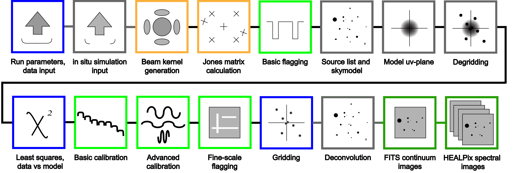

.. PyFHD documentation master file, created by
   sphinx-quickstart on Thu Feb 10 09:34:00 2022.
   You can adapt this file completely to your liking, but it should at least
   contain the root `toctree` directive.

Welcome to PyFHD's documentation!
=================================

.. toctree::
   :maxdepth: 2
   :caption: Contents

**Py**\thon 
**F**\ast 
**H**\olographic 
**D**\econvolution

Started as a project created in IDL, FHD is an open-source imaging algorithm for radio interferometers, 
specifically tested on MWA Phase I, MWA Phase II, PAPER, and HERA. There are three main use-cases for FHD: 
efficient image deconvolution for general radio astronomy, fast-mode Epoch of Reionization analysis, and simulation.

Now, FHD has been translated to Python, giving us **PyFHD**, free to use and free of IDL.

An image displaying the progress of PyFHD translation is shown below:

Boxes that are greyed out, have not been translated. In the case of the Beam kernel generation and the Jones Matrix Calculation,
these have been translated but are in an alpha state and need testing. Degridding has also been translated also, but hasn't been tested
in anyway at all.

Contents
-----------------

.. toctree::
   :maxdepth: 2

   installation/installation
   tutorial/tutorial
   develop/contribution_guide
   develop/idl_translation
   documentation/documentation
   changelog/changelog
   reports/unit_test_report
   reports/coverage_report
   reports/documentation_report
   reports/example_profile
   
Browse
-----------------

* :ref:`genindex`
* :ref:`modindex`
