.. _MWA ASVO: https://asvo.mwatelescope.org/
.. _Birli: https://github.com/MWATelescope/Birli
.. _WODEN: https://woden.readthedocs.io/en/latest/index.html
.. _FHD: https://github.com/EoRImaging/FHD
.. _pyuvdata: https://pyuvdata.readthedocs.io/en/latest/index.html

.. _tutorial:

Tutorial
=========

First make sure you have installed ``PyFHD`` following the instructions in the :doc:`Installation Guide <../installation/installation>`.

Let's start with getting you off the ground and running using the sample data built into ``PyFHD``. 
The example data is a small subset of the observation ``1088285600`` with a beam that uses only one frequency, 
and a skymodel created using `WODEN`_. To run ``PyFHD`` we will use the command line interface (CLI) that has been
built to run ``PyFHD``.

.. _sample-data:

Sample Data
-----------

To run the example data, you'll need to get the sample data first, to do this run:

.. code-block:: bash

  pyfhd --get-sample-data 1088285600

Which will copy the sample data built into the PyFHD package to your current working directory, inside a directory and sub-directory called ``input/1088285600_example``.

Running the sample data
-----------------------

From there in that directory, you should be able to run the following command to run the example data:

.. code-block:: bash

  pyfhd -c ./input/1088285600_example/1088285600_example.yaml 1088285600

The command on most machines takes 1-2 minutes to run, and the output is stored in the ``output`` directory. 

This will run the entire PyFHD pipeline in this order: 
1. Setting up the run with logs and outputs 
2. Extracting visibilities
3. Creating the observation metadata dictionary (and other metadata dictionaries)
4. Import the beam
5. Importing the skymodel
6. Running calibration 
7. Flagging 
8. Gridding 
9. Exporting the results
10. Generating HEALPIX fits and HEALPIX files (in HDF5 format)
11. Finishing the run and cleaning up

If the command runs successfully you should get a log to your terminal (stdout) that looks something like this:

.. raw:: html

  

  
Sample Data PyFHD Collapsible Log

  

.. code-block:: text
                                                                            
  ooooooooo.               oooooooooooo ooooo   ooooo oooooooooo.    
  8888   `Y88.             8888       8 8888    888   888     Y8b    
  888   .d88' oooo    ooo  888          888     888   888      888   
  888ooo88P'   `88.  .8'   888oooo8     888ooooo888   888      888   
  888           `88..8'    888          888     888   888      888   
  888            `888'     888          888     888   888     d88'   
  o888o            .8'     o888o        o888o   o888o o888bood8P'    
              .o..P'                                                
              `Y8P'                                                  
                                                                    
  Python Fast Holographic Deconvolution 

  Translated from IDL to Python as a collaboration between Astronomy Data and Computing Services (ADACS) and the Epoch of Reionisation (EoR) Team.

  Repository: https://github.com/EoRImaging/PyFHD

  Documentation: https://pyfhd.readthedocs.io/en/latest/

  Git Commit Hash: 467cb91bcba3f06cded5405f3ffcc9638bd13c26

  PyFHD Run Started At: Fri May 30 09:52:35 2025

  Observation ID: 1088285600

  Confifuration File: ./input/1088285600 example/1088285600 example.yaml

  Validating your input...

  2025-05-30 09:52:35 - INFO:
    Logging and configuration file created and copied to here: /home/skywatcher/projects/PyFHD/output/pyfhd_1088285600_example
  2025-05-30 09:52:35 - INFO:
    Input validated, starting PyFHD run now
  2025-05-30 09:52:35 - INFO:
    Reading in visibilities from: input/1088285600_example/1088285600.uvfits
  2025-05-30 09:52:35 - WARNING:
    OBSRA not found in UVFITS file
  2025-05-30 09:52:35 - WARNING:
    OBSDEC not found in UVFITS file
  2025-05-30 09:52:35 - INFO:
    Setting mwa instrument location to: lon 116.67, lat -26.70, alt 377.83
  2025-05-30 09:52:35 - INFO:
    PyFHD Header Created completed in: 44.74807 milliseconds
  2025-05-30 09:52:35 - INFO:
    Params Created completed in: 0.27895 milliseconds
  2025-05-30 09:52:35 - INFO:
    Visibilities Extracted completed in: 9.38296 milliseconds
  2025-05-30 09:52:35 - INFO:
    Writing the visibilities array to output/pyfhd_1088285600_example/visibilities/1088285600_raw_vis_arr.h5
  2025-05-30 09:52:35 - INFO:
    Writing the weights array to output/pyfhd_1088285600_example/visibilities/1088285600_raw_vis_weights.h5
  2025-05-30 09:52:35 - WARNING:
    Number of Leap Seconds is missing and the time system isn't IAT so we can't know the leap seconds, setting as -1
  2025-05-30 09:52:35 - WARNING:
    PolA params is missing from the UVFITS, set to array of zeros of length n_pol_cal_params or 0
  2025-05-30 09:52:35 - WARNING:
    PolB params is missing from the UVFITS, set to array of zeros of length n_pol_cal_params or 0
  2025-05-30 09:52:35 - INFO:
    Diameters not in UVFITS file continuing.
  2025-05-30 09:52:35 - INFO:
    Beam Full Width Half maximum not present in UVFITS continuing.
  2025-05-30 09:52:35 - INFO:
    Writing the layout dict to output/pyfhd_1088285600_example/layout.h5, each key will be a dataset, if the key contains a dict then it will be a group.
  2025-05-30 09:52:35 - INFO:
    Layout Dictionary Extracted completed in: 7.91407 milliseconds
  2025-05-30 09:52:38 - INFO:
    Obs Dictionary Created completed in: 2.92785 seconds
  2025-05-30 09:52:38 - INFO:
    Writing the obs_checkpoint dict to output/pyfhd_1088285600_example/checkpoints/1088285600_example_obs_checkpoint.h5, each key will be a dataset, if the key contains a dict then it will be a group.
  2025-05-30 09:52:39 - INFO:
    Checkpoint Saved: Uncalibrated visibility parameters, array and weights and the observation metadata dictionary saved into output/pyfhd_1088285600_example/obs_checkpoint.h5
  2025-05-30 09:52:39 - INFO:
    Reading in the HDF5 file input/1088285600_example/gauss_beam_pointing0_167635008Hz.h5
  2025-05-30 09:52:39 - INFO:
    Loading input/1088285600_example/gauss_beam_pointing0_167635008Hz.h5 into a dictionary
  2025-05-30 09:52:39 - INFO:
    Beam and PSF dictionary imported. completed in: 301.2073 milliseconds
  2025-05-30 09:52:39 - INFO:
    Basic Flagging Completed completed in: 2.48504 milliseconds
  2025-05-30 09:52:40 - INFO:
    Visibilities Weights Updated After Basic Flagging completed in: 1.17173 seconds
  2025-05-30 09:52:40 - INFO:
    Reading in model visibilities from: /home/skywatcher/projects/PyFHD/input/1088285600_example/1088285600_model.uvfits
  2025-05-30 09:52:40 - INFO:
    Setting mwa instrument location to: lon 116.67, lat -26.70, alt 377.83
  2025-05-30 09:52:40 - WARNING:
    Model time stamps are offset from data by an average of 1.0. Accounting for this to match model time steps to data
  2025-05-30 09:52:40 - INFO:
    Found flagged tiles [4, 124] in the data, flagging from the model
  2025-05-30 09:52:40 - INFO:
    Model Imported and Flagged From UVFITS completed in: 20.36548 milliseconds
  2025-05-30 09:52:40 - INFO:
    Beginning Calibration
  2025-05-30 09:52:40 - INFO:
    Gain initialized beginning vis_calibrate subroutine
  2025-05-30 09:52:40 - INFO:
    Beginning Calibration for polarization 0 (XX)
  2025-05-30 09:52:40 - INFO:
    Convergence was reached for polarization: XX (0) and frequency: 1, with a convergence of: 9.98593970029745e-08 and the threshold was: 1e-07
  2025-05-30 09:52:40 - INFO:
    Convergence was reached for polarization: XX (0) and frequency: 2, with a convergence of: 9.999992919655905e-08 and the threshold was: 1e-07
  2025-05-30 09:52:40 - INFO:
    Convergence was reached for polarization: XX (0) and frequency: 3, with a convergence of: 8.344520524730864e-08 and the threshold was: 1e-07
  2025-05-30 09:52:41 - INFO:
    Convergence was reached for polarization: XX (0) and frequency: 4, with a convergence of: 9.884876342819337e-08 and the threshold was: 1e-07
  2025-05-30 09:52:41 - INFO:
    Convergence was reached for polarization: XX (0) and frequency: 5, with a convergence of: 8.003533551747955e-08 and the threshold was: 1e-07
  2025-05-30 09:52:41 - INFO:
    Convergence was reached for polarization: XX (0) and frequency: 6, with a convergence of: 8.544033568047118e-08 and the threshold was: 1e-07
  2025-05-30 09:52:41 - INFO:
    Convergence was reached for polarization: XX (0) and frequency: 7, with a convergence of: 8.130504801062689e-08 and the threshold was: 1e-07
  2025-05-30 09:52:41 - INFO:
    Convergence was reached for polarization: XX (0) and frequency: 8, with a convergence of: 9.104656101282636e-08 and the threshold was: 1e-07
  2025-05-30 09:52:41 - INFO:
    Convergence was reached for polarization: XX (0) and frequency: 9, with a convergence of: 8.354614840674757e-08 and the threshold was: 1e-07
  2025-05-30 09:52:41 - INFO:
    Convergence was reached for polarization: XX (0) and frequency: 10, with a convergence of: 9.918106515438548e-08 and the threshold was: 1e-07
  2025-05-30 09:52:41 - INFO:
    Convergence was reached for polarization: XX (0) and frequency: 11, with a convergence of: 9.869434977124244e-08 and the threshold was: 1e-07
  2025-05-30 09:52:42 - INFO:
    Convergence was reached for polarization: XX (0) and frequency: 12, with a convergence of: 8.895645139753463e-08 and the threshold was: 1e-07
  2025-05-30 09:52:42 - INFO:
    Convergence was reached for polarization: XX (0) and frequency: 13, with a convergence of: 9.459813804237299e-08 and the threshold was: 1e-07
  2025-05-30 09:52:42 - INFO:
    Beginning Calibration for polarization 1 (YY)
  2025-05-30 09:52:42 - INFO:
    Convergence was reached for polarization: YY (1) and frequency: 1, with a convergence of: 8.583005611987811e-08 and the threshold was: 1e-07
  2025-05-30 09:52:42 - INFO:
    Convergence was reached for polarization: YY (1) and frequency: 2, with a convergence of: 8.466878902748548e-08 and the threshold was: 1e-07
  2025-05-30 09:52:42 - INFO:
    Convergence was reached for polarization: YY (1) and frequency: 3, with a convergence of: 9.921026305432663e-08 and the threshold was: 1e-07
  2025-05-30 09:52:42 - INFO:
    Convergence was reached for polarization: YY (1) and frequency: 4, with a convergence of: 8.426838709848088e-08 and the threshold was: 1e-07
  2025-05-30 09:52:42 - INFO:
    Convergence was reached for polarization: YY (1) and frequency: 5, with a convergence of: 8.969077306790065e-08 and the threshold was: 1e-07
  2025-05-30 09:52:42 - INFO:
    Convergence was reached for polarization: YY (1) and frequency: 6, with a convergence of: 9.584932160621179e-08 and the threshold was: 1e-07
  2025-05-30 09:52:43 - INFO:
    Convergence was reached for polarization: YY (1) and frequency: 7, with a convergence of: 9.976283744227554e-08 and the threshold was: 1e-07
  2025-05-30 09:52:43 - INFO:
    Convergence was reached for polarization: YY (1) and frequency: 8, with a convergence of: 9.165962316245378e-08 and the threshold was: 1e-07
  2025-05-30 09:52:43 - INFO:
    Convergence was reached for polarization: YY (1) and frequency: 9, with a convergence of: 8.711660483214532e-08 and the threshold was: 1e-07
  2025-05-30 09:52:43 - INFO:
    Convergence was reached for polarization: YY (1) and frequency: 10, with a convergence of: 8.482012447714498e-08 and the threshold was: 1e-07
  2025-05-30 09:52:43 - INFO:
    Convergence was reached for polarization: YY (1) and frequency: 11, with a convergence of: 8.962296769672843e-08 and the threshold was: 1e-07
  2025-05-30 09:52:43 - INFO:
    Convergence was reached for polarization: YY (1) and frequency: 12, with a convergence of: 8.715709933918354e-08 and the threshold was: 1e-07
  2025-05-30 09:52:43 - INFO:
    Convergence was reached for polarization: YY (1) and frequency: 13, with a convergence of: 8.780971269246983e-08 and the threshold was: 1e-07
  2025-05-30 09:52:43 - INFO:
    Function vis_calibrate_subroutine has completed.
  2025-05-30 09:52:43 - INFO:
    Flagging Calibration has been activated and calibration will now be flagged
  2025-05-30 09:52:43 - INFO:
    You have chosen to perform a bandpass calculation and calibration
  2025-05-30 09:52:43 - WARNING:
    /home/skywatcher/projects/PyFHD/PyFHD/pyfhd_tools/pyfhd_utils.py:709: RuntimeWarning: overflow encountered in divide
    result[i_use] = 1 / weights[i_use]

  2025-05-30 09:52:43 - INFO:
    You have selected to perform polynomial fits over the frequency band
  2025-05-30 09:52:44 - INFO:
    Applying the calibration
  2025-05-30 09:52:44 - INFO:
    Saving the ratio and sigma average variance
  2025-05-30 09:52:44 - INFO:
    Calculating statistics from calibration
  2025-05-30 09:52:44 - INFO:
    Plotting the calibration solutions into output/pyfhd_1088285600_example/plots/calibration
  2025-05-30 09:52:55 - INFO:
    Visibilities calibrated and cal dictionary with gains created completed in: 15.02258 seconds
  2025-05-30 09:52:55 - INFO:
    Visibilities Weights Updated After Calibration completed in: 50.36974 milliseconds
  2025-05-30 09:52:55 - INFO:
    Noise Calculated and added to obs completed in: 7.34496 milliseconds
  2025-05-30 09:52:55 - INFO:
    Writing the calibrate_checkpoint dict to output/pyfhd_1088285600_example/checkpoints/1088285600_example_calibrate_checkpoint.h5, each key will be a dataset, if the key contains a dict then it will be a group.
  2025-05-30 09:52:56 - INFO:
    Checkpoint Saved: Calibrated and Flagged visibility parameters, array and weights, the flagged observation metadata dictionary and the calibration dictionary saved into output/pyfhd_1088285600_example/calibrate_checkpoint.h5
  2025-05-30 09:52:56 - INFO:
    Gridding has begun for polarization XX
  2025-05-30 09:52:57 - INFO:
    Gridding  visibilities for baseline 2782 of 27825 for polarization XX
  2025-05-30 09:52:57 - INFO:
    Gridding  visibilities for baseline 5564 of 27825 for polarization XX
  2025-05-30 09:52:58 - INFO:
    Gridding  visibilities for baseline 8346 of 27825 for polarization XX
  2025-05-30 09:52:59 - INFO:
    Gridding  visibilities for baseline 11128 of 27825 for polarization XX
  2025-05-30 09:52:59 - INFO:
    Gridding  visibilities for baseline 13910 of 27825 for polarization XX
  2025-05-30 09:53:00 - INFO:
    Gridding  visibilities for baseline 16692 of 27825 for polarization XX
  2025-05-30 09:53:01 - INFO:
    Gridding  visibilities for baseline 19474 of 27825 for polarization XX
  2025-05-30 09:53:02 - INFO:
    Gridding  visibilities for baseline 22256 of 27825 for polarization XX
  2025-05-30 09:53:03 - INFO:
    Gridding  visibilities for baseline 25038 of 27825 for polarization XX
  2025-05-30 09:53:04 - INFO:
    Gridding  visibilities for baseline 27820 of 27825 for polarization XX
  2025-05-30 09:53:04 - INFO:
    Gridding has finished for polarization XX
  2025-05-30 09:53:04 - INFO:
    Gridding has begun for polarization YY
  2025-05-30 09:53:05 - INFO:
    Gridding  visibilities for baseline 2782 of 27825 for polarization YY
  2025-05-30 09:53:06 - INFO:
    Gridding  visibilities for baseline 5564 of 27825 for polarization YY
  2025-05-30 09:53:06 - INFO:
    Gridding  visibilities for baseline 8346 of 27825 for polarization YY
  2025-05-30 09:53:07 - INFO:
    Gridding  visibilities for baseline 11128 of 27825 for polarization YY
  2025-05-30 09:53:08 - INFO:
    Gridding  visibilities for baseline 13910 of 27825 for polarization YY
  2025-05-30 09:53:08 - INFO:
    Gridding  visibilities for baseline 16692 of 27825 for polarization YY
  2025-05-30 09:53:09 - INFO:
    Gridding  visibilities for baseline 19474 of 27825 for polarization YY
  2025-05-30 09:53:10 - INFO:
    Gridding  visibilities for baseline 22256 of 27825 for polarization YY
  2025-05-30 09:53:11 - INFO:
    Gridding  visibilities for baseline 25038 of 27825 for polarization YY
  2025-05-30 09:53:13 - INFO:
    Gridding  visibilities for baseline 27820 of 27825 for polarization YY
  2025-05-30 09:53:13 - INFO:
    Gridding has finished for polarization YY
  2025-05-30 09:53:13 - INFO:
    Plotting the continuum gridding outputs into output/pyfhd_1088285600_example/plots/gridding
  2025-05-30 09:53:19 - INFO:
    Writing the gridding_checkpoint dict to output/pyfhd_1088285600_example/checkpoints/1088285600_example_gridding_checkpoint.h5, each key will be a dataset, if the key contains a dict then it will be a group.
  2025-05-30 09:53:25 - INFO:
    Checkpoint Saved: The Gridded UV Planes saved into output/pyfhd_1088285600_example/gridding_checkpoint.h5
  2025-05-30 09:53:25 - INFO:
    Visibilities gridded completed in: 29.42883 seconds
  2025-05-30 09:53:25 - INFO:
    Saving the obs dictionary to output/pyfhd_1088285600_example/metadata/1088285600_obs.h5
  2025-05-30 09:53:25 - INFO:
    Writing the obs dict to output/pyfhd_1088285600_example/metadata/1088285600_obs.h5, each key will be a dataset, if the key contains a dict then it will be a group.
  2025-05-30 09:53:25 - INFO:
    Saving params dictionary to output/pyfhd_1088285600_example/metadata/1088285600_params.h5
  2025-05-30 09:53:25 - INFO:
    Writing the params dict to output/pyfhd_1088285600_example/metadata/1088285600_params.h5, each key will be a dataset, if the key contains a dict then it will be a group.
  2025-05-30 09:53:25 - INFO:
    Saving the gridded uv planes to output/pyfhd_1088285600_example/gridding
  2025-05-30 09:53:25 - INFO:
    Writing the image_uv array to output/pyfhd_1088285600_example/gridding/1088285600_image_uv.h5
  2025-05-30 09:53:27 - INFO:
    Writing the weights_uv array to output/pyfhd_1088285600_example/gridding/1088285600_weights_uv.h5
  2025-05-30 09:53:28 - INFO:
    Writing the variance_uv array to output/pyfhd_1088285600_example/gridding/1088285600_variance_uv.h5
  2025-05-30 09:53:29 - INFO:
    Writing the uniform_filter_uv array to output/pyfhd_1088285600_example/gridding/1088285600_uniform_filter_uv.h5
  2025-05-30 09:53:29 - INFO:
    Writing the model_uv array to output/pyfhd_1088285600_example/gridding/1088285600_model_uv.h5
  2025-05-30 09:53:31 - INFO:
    Saving the calibrated visibilities to output/pyfhd_1088285600_example/visibilities/1088285600_calibrated_vis_arr.h5
  2025-05-30 09:53:31 - INFO:
    Writing the visibilities array to output/pyfhd_1088285600_example/visibilities/1088285600_calibrated_vis_arr.h5
  2025-05-30 09:53:31 - INFO:
    Saving the calibration dictionary to output/pyfhd_1088285600_example/calibration/1088285600_cal.h5
  2025-05-30 09:53:31 - INFO:
    Writing the cal dict to output/pyfhd_1088285600_example/calibration/1088285600_cal.h5, each key will be a dataset, if the key contains a dict then it will be a group.
  2025-05-30 09:53:31 - INFO:
    Saving the calibrated weights to output/pyfhd_1088285600_example/visibilities/1088285600_calibrated_vis_weights.h5
  2025-05-30 09:53:31 - INFO:
    Writing the weights array to output/pyfhd_1088285600_example/visibilities/1088285600_calibrated_vis_weights.h5
  2025-05-30 09:53:34 - INFO:
    Using filter_uv_uniform for dirty_image_generate
  2025-05-30 09:53:34 - INFO:
    Using filter_uv_uniform for dirty_image_generate
  2025-05-30 09:53:36 - INFO:
    Building the FITS Header for all the FITS files
  2025-05-30 09:53:36 - INFO:
    Saving the FITS files for polarization XX
  2025-05-30 09:53:36 - INFO:
    Plotting the continuum images for polarization XX into output/pyfhd_1088285600_example/plots/images
  2025-05-30 09:53:36 - WARNING:
    /home/skywatcher/projects/PyFHD/.venv/lib/python3.13/site-packages/astropy/wcs/wcs.py:537: FITSFixedWarning: RADECSYS= 'ICRS ' / Reference Frame 
  the RADECSYS keyword is deprecated, use RADESYSa.
    wcsprm = _wcs.Wcsprm(

  2025-05-30 09:53:37 - WARNING:
    /home/skywatcher/projects/PyFHD/.venv/lib/python3.13/site-packages/astropy/wcs/wcs.py:537: FITSFixedWarning: RADECSYS= 'ICRS ' / Reference Frame 
  the RADECSYS keyword is deprecated, use RADESYSa.
    wcsprm = _wcs.Wcsprm(

  2025-05-30 09:53:38 - WARNING:
    /home/skywatcher/projects/PyFHD/.venv/lib/python3.13/site-packages/astropy/wcs/wcs.py:537: FITSFixedWarning: RADECSYS= 'ICRS ' / Reference Frame 
  the RADECSYS keyword is deprecated, use RADESYSa.
    wcsprm = _wcs.Wcsprm(

  2025-05-30 09:53:38 - WARNING:
    /home/skywatcher/projects/PyFHD/.venv/lib/python3.13/site-packages/astropy/wcs/wcs.py:537: FITSFixedWarning: RADECSYS= 'ICRS ' / Reference Frame 
  the RADECSYS keyword is deprecated, use RADESYSa.
    wcsprm = _wcs.Wcsprm(

  2025-05-30 09:53:39 - WARNING:
    FITS data must be a 2D array, no image made for output/pyfhd_1088285600_example/fits/1088285600_uv_weights_XX.fits.
  2025-05-30 09:53:39 - INFO:
    Saving the FITS files for polarization YY
  2025-05-30 09:53:39 - INFO:
    Plotting the continuum images for polarization YY into output/pyfhd_1088285600_example/plots/images
  2025-05-30 09:53:39 - WARNING:
    /home/skywatcher/projects/PyFHD/.venv/lib/python3.13/site-packages/astropy/wcs/wcs.py:537: FITSFixedWarning: RADECSYS= 'ICRS ' / Reference Frame 
  the RADECSYS keyword is deprecated, use RADESYSa.
    wcsprm = _wcs.Wcsprm(

  2025-05-30 09:53:40 - WARNING:
    /home/skywatcher/projects/PyFHD/.venv/lib/python3.13/site-packages/astropy/wcs/wcs.py:537: FITSFixedWarning: RADECSYS= 'ICRS ' / Reference Frame 
  the RADECSYS keyword is deprecated, use RADESYSa.
    wcsprm = _wcs.Wcsprm(

  2025-05-30 09:53:41 - WARNING:
    /home/skywatcher/projects/PyFHD/.venv/lib/python3.13/site-packages/astropy/wcs/wcs.py:537: FITSFixedWarning: RADECSYS= 'ICRS ' / Reference Frame 
  the RADECSYS keyword is deprecated, use RADESYSa.
    wcsprm = _wcs.Wcsprm(

  2025-05-30 09:53:42 - WARNING:
    /home/skywatcher/projects/PyFHD/.venv/lib/python3.13/site-packages/astropy/wcs/wcs.py:537: FITSFixedWarning: RADECSYS= 'ICRS ' / Reference Frame 
  the RADECSYS keyword is deprecated, use RADESYSa.
    wcsprm = _wcs.Wcsprm(

  2025-05-30 09:53:43 - WARNING:
    FITS data must be a 2D array, no image made for output/pyfhd_1088285600_example/fits/1088285600_uv_weights_YY.fits.
  2025-05-30 09:53:43 - INFO:
    Loading /home/skywatcher/projects/PyFHD/PyFHD/templates/EoR0_high_healpix_inds.h5 into a dictionary
  2025-05-30 09:53:44 - WARNING:
    All data flagged or cut!
  2025-05-30 09:53:44 - ERROR:
    All data has been flagged
  2025-05-30 09:53:44 - WARNING:
    No visibilities gridded for frequency channel [14 15] and polarization XX (0)
  2025-05-30 09:53:44 - INFO:
    Writing the 1088285600_even_XX_dirty_uv_arr_gridded_uvf.h5 dict to output/pyfhd_1088285600_example/healpix/uvf_grid/1088285600_even_XX_dirty_uv_arr_gridded_uvf.h5, each key will be a dataset, if the key contains a dict then it will be a group.
  2025-05-30 09:53:45 - INFO:
    Writing the 1088285600_even_XX_weights_uv_gridded_uvf.h5 dict to output/pyfhd_1088285600_example/healpix/uvf_grid/1088285600_even_XX_weights_uv_gridded_uvf.h5, each key will be a dataset, if the key contains a dict then it will be a group.
  2025-05-30 09:53:46 - INFO:
    Writing the 1088285600_even_XX_variance_uv_arr_gridded_uvf.h5 dict to output/pyfhd_1088285600_example/healpix/uvf_grid/1088285600_even_XX_variance_uv_arr_gridded_uvf.h5, each key will be a dataset, if the key contains a dict then it will be a group.
  2025-05-30 09:53:47 - INFO:
    Writing the 1088285600_even_XX_model_uv_arr_gridded_uvf.h5 dict to output/pyfhd_1088285600_example/healpix/uvf_grid/1088285600_even_XX_model_uv_arr_gridded_uvf.h5, each key will be a dataset, if the key contains a dict then it will be a group.
  2025-05-30 09:53:49 - INFO:
    Writing the 1088285600_hpx_even_XX dict to output/pyfhd_1088285600_example/healpix/1088285600_hpx_even_XX.h5, each key will be a dataset, if the key contains a dict then it will be a group.
  2025-05-30 09:53:51 - WARNING:
    All data flagged or cut!
  2025-05-30 09:53:51 - ERROR:
    All data has been flagged
  2025-05-30 09:53:51 - WARNING:
    No visibilities gridded for frequency channel [14 15] and polarization YY (1)
  2025-05-30 09:53:51 - INFO:
    Writing the 1088285600_even_YY_dirty_uv_arr_gridded_uvf.h5 dict to output/pyfhd_1088285600_example/healpix/uvf_grid/1088285600_even_YY_dirty_uv_arr_gridded_uvf.h5, each key will be a dataset, if the key contains a dict then it will be a group.
  2025-05-30 09:53:52 - INFO:
    Writing the 1088285600_even_YY_weights_uv_gridded_uvf.h5 dict to output/pyfhd_1088285600_example/healpix/uvf_grid/1088285600_even_YY_weights_uv_gridded_uvf.h5, each key will be a dataset, if the key contains a dict then it will be a group.
  2025-05-30 09:53:53 - INFO:
    Writing the 1088285600_even_YY_variance_uv_arr_gridded_uvf.h5 dict to output/pyfhd_1088285600_example/healpix/uvf_grid/1088285600_even_YY_variance_uv_arr_gridded_uvf.h5, each key will be a dataset, if the key contains a dict then it will be a group.
  2025-05-30 09:53:54 - INFO:
    Writing the 1088285600_even_YY_model_uv_arr_gridded_uvf.h5 dict to output/pyfhd_1088285600_example/healpix/uvf_grid/1088285600_even_YY_model_uv_arr_gridded_uvf.h5, each key will be a dataset, if the key contains a dict then it will be a group.
  2025-05-30 09:53:55 - INFO:
    Writing the 1088285600_hpx_even_YY dict to output/pyfhd_1088285600_example/healpix/1088285600_hpx_even_YY.h5, each key will be a dataset, if the key contains a dict then it will be a group.
  2025-05-30 09:53:57 - WARNING:
    All data flagged or cut!
  2025-05-30 09:53:57 - ERROR:
    All data has been flagged
  2025-05-30 09:53:57 - WARNING:
    No visibilities gridded for frequency channel [14 15] and polarization XX (0)
  2025-05-30 09:53:57 - INFO:
    Writing the 1088285600_odd_XX_dirty_uv_arr_gridded_uvf.h5 dict to output/pyfhd_1088285600_example/healpix/uvf_grid/1088285600_odd_XX_dirty_uv_arr_gridded_uvf.h5, each key will be a dataset, if the key contains a dict then it will be a group.
  2025-05-30 09:53:58 - INFO:
    Writing the 1088285600_odd_XX_weights_uv_gridded_uvf.h5 dict to output/pyfhd_1088285600_example/healpix/uvf_grid/1088285600_odd_XX_weights_uv_gridded_uvf.h5, each key will be a dataset, if the key contains a dict then it will be a group.
  2025-05-30 09:53:59 - INFO:
    Writing the 1088285600_odd_XX_variance_uv_arr_gridded_uvf.h5 dict to output/pyfhd_1088285600_example/healpix/uvf_grid/1088285600_odd_XX_variance_uv_arr_gridded_uvf.h5, each key will be a dataset, if the key contains a dict then it will be a group.
  2025-05-30 09:54:00 - INFO:
    Writing the 1088285600_odd_XX_model_uv_arr_gridded_uvf.h5 dict to output/pyfhd_1088285600_example/healpix/uvf_grid/1088285600_odd_XX_model_uv_arr_gridded_uvf.h5, each key will be a dataset, if the key contains a dict then it will be a group.
  2025-05-30 09:54:02 - INFO:
    Writing the 1088285600_hpx_odd_XX dict to output/pyfhd_1088285600_example/healpix/1088285600_hpx_odd_XX.h5, each key will be a dataset, if the key contains a dict then it will be a group.
  2025-05-30 09:54:04 - WARNING:
    All data flagged or cut!
  2025-05-30 09:54:04 - ERROR:
    All data has been flagged
  2025-05-30 09:54:04 - WARNING:
    No visibilities gridded for frequency channel [14 15] and polarization YY (1)
  2025-05-30 09:54:04 - INFO:
    Writing the 1088285600_odd_YY_dirty_uv_arr_gridded_uvf.h5 dict to output/pyfhd_1088285600_example/healpix/uvf_grid/1088285600_odd_YY_dirty_uv_arr_gridded_uvf.h5, each key will be a dataset, if the key contains a dict then it will be a group.
  2025-05-30 09:54:05 - INFO:
    Writing the 1088285600_odd_YY_weights_uv_gridded_uvf.h5 dict to output/pyfhd_1088285600_example/healpix/uvf_grid/1088285600_odd_YY_weights_uv_gridded_uvf.h5, each key will be a dataset, if the key contains a dict then it will be a group.
  2025-05-30 09:54:06 - INFO:
    Writing the 1088285600_odd_YY_variance_uv_arr_gridded_uvf.h5 dict to output/pyfhd_1088285600_example/healpix/uvf_grid/1088285600_odd_YY_variance_uv_arr_gridded_uvf.h5, each key will be a dataset, if the key contains a dict then it will be a group.
  2025-05-30 09:54:07 - INFO:
    Writing the 1088285600_odd_YY_model_uv_arr_gridded_uvf.h5 dict to output/pyfhd_1088285600_example/healpix/uvf_grid/1088285600_odd_YY_model_uv_arr_gridded_uvf.h5, each key will be a dataset, if the key contains a dict then it will be a group.
  2025-05-30 09:54:08 - INFO:
    Writing the 1088285600_hpx_odd_YY dict to output/pyfhd_1088285600_example/healpix/1088285600_hpx_odd_YY.h5, each key will be a dataset, if the key contains a dict then it will be a group.
  2025-05-30 09:54:09 - INFO:
    Writing the pyfhd_config dict to output/pyfhd_1088285600_example/config/pyfhd_config.h5, each key will be a dataset, if the key contains a dict then it will be a group.
  2025-05-30 09:54:09 - INFO:
    PyFHD Run Completed for 1088285600
  Total Runtime (Days:Hours:Minutes:Seconds.Millseconds): 0:01:33.849671

.. raw:: html

  

  

Take note of the line:

.. code-block:: text

  Logging and configuration file created and copied to here: /home/skywatcher/projects/PyFHD/output/pyfhd_1088285600_example

More details about the output of the PyFHD pipeline and the required inputs is clarified in the next section. 

The Required Inputs and the outputs of ``PyFHD``
----------------------------------------------------------

``PyFHD`` only requires an observation ID to run.
``PyFHD`` will get a default ``pyfhd.yaml`` configuration file from it's resources directory inside the package, so when specifying only
the observation ID, it will use the default configuration file. The default configuration is not suitable for every observation, so it's
likely you'll need to adjust the default configuration file to suit your needs. Some validation is performed before and during runtime of 
``PyFHD`` to check for incompatibilities though it is not exhaustive.

.. note::
  If you wish to use the default configuration file to do your own configurations, from inside the repository, you can find the configuration file
  in the resources directory of PyFHD, ``PyFHD/PyFHD/resources/config/pyfhd.yaml``. You can also find the default configuration file at this link here:

  `pyfhd.yaml <https://raw.githubusercontent.com/EoRImaging/PyFHD/refs/heads/main/PyFHD/resources/config/pyfhd.yaml>`_

Some files can be discovered automatically through the ``input-path`` option of ``PyFHD`` so read through the usage help text to work 
out how you wish to configure your input. ``PyFHD`` is rather flexible on how you do your input
as many of the files you may require can be in completely separate directories.

The output of ``PyFHD`` is automatically generated and stores everything in one directory with the name ``pyfhd_YYYY_MM_DD_HH_mm_ss`` if you don't use the ``--description`` option.
In the case of using the ``--description`` option then the output directory generated will be ``pyfhd_your_description_here``. The example run we used above uses the ``--description`` as ``'1088285600_example'``
option so the output directory generated will be ``pyfhd_1088285600_example``. The path where the output directory will be generated is ``--output-path`` (by default ``./output``), assuming you're looking at the example run above,
the output directory structure will look like this:

.. code-block:: bash

  output
  └── pyfhd_1088285600_example
      ├── calibration
      │   └── 1088285600_cal.h5
      ├── checkpoints
      │   ├── 1088285600_example_calibrate_checkpoint.h5
      │   ├── 1088285600_example_gridding_checkpoint.h5
      │   └── 1088285600_example_obs_checkpoint.h5
      ├── config
      │   ├── pyfhd_1088285600_example_2025_05_30_09_52_35-final.yaml
      │   ├── pyfhd_1088285600_example_2025_05_30_09_52_35.yaml
      │   └── pyfhd_config.h5
      ├── fits
      │   ├── 1088285600_beam_XX.fits
      │   ├── 1088285600_beam_YY.fits
      │   ├── 1088285600_uniform_dirty_XX.fits
      │   ├── 1088285600_uniform_dirty_YY.fits
      │   ├── 1088285600_uniform_model_XX.fits
      │   ├── 1088285600_uniform_model_YY.fits
      │   ├── 1088285600_uniform_residual_XX.fits
      │   ├── 1088285600_uniform_residual_YY.fits
      │   ├── 1088285600_uv_weights_XX.fits
      │   └── 1088285600_uv_weights_YY.fits
      ├── gridding
      │   ├── 1088285600_image_uv.h5
      │   ├── 1088285600_model_uv.h5
      │   ├── 1088285600_uniform_filter_uv.h5
      │   ├── 1088285600_variance_uv.h5
      │   └── 1088285600_weights_uv.h5
      ├── healpix
      │   ├── 1088285600_hpx_even_XX.h5
      │   ├── 1088285600_hpx_even_YY.h5
      │   ├── 1088285600_hpx_odd_XX.h5
      │   ├── 1088285600_hpx_odd_YY.h5
      │   └── uvf_grid
      │       ├── 1088285600_even_XX_dirty_uv_arr_gridded_uvf.h5
      │       ├── 1088285600_even_XX_model_uv_arr_gridded_uvf.h5
      │       ├── 1088285600_even_XX_variance_uv_arr_gridded_uvf.h5
      │       ├── 1088285600_even_XX_weights_uv_gridded_uvf.h5
      │       ├── 1088285600_even_YY_dirty_uv_arr_gridded_uvf.h5
      │       ├── 1088285600_even_YY_model_uv_arr_gridded_uvf.h5
      │       ├── 1088285600_even_YY_variance_uv_arr_gridded_uvf.h5
      │       ├── 1088285600_even_YY_weights_uv_gridded_uvf.h5
      │       ├── 1088285600_odd_XX_dirty_uv_arr_gridded_uvf.h5
      │       ├── 1088285600_odd_XX_model_uv_arr_gridded_uvf.h5
      │       ├── 1088285600_odd_XX_variance_uv_arr_gridded_uvf.h5
      │       ├── 1088285600_odd_XX_weights_uv_gridded_uvf.h5
      │       ├── 1088285600_odd_YY_dirty_uv_arr_gridded_uvf.h5
      │       ├── 1088285600_odd_YY_model_uv_arr_gridded_uvf.h5
      │       ├── 1088285600_odd_YY_variance_uv_arr_gridded_uvf.h5
      │       └── 1088285600_odd_YY_weights_uv_gridded_uvf.h5
      ├── layout.h5
      ├── metadata
      │   ├── 1088285600_obs.h5
      │   └── 1088285600_params.h5
      ├── plots
      │   ├── calibration
      │   │   ├── 1088285600_cal_amp.png
      │   │   ├── 1088285600_cal_phase.png
      │   │   ├── 1088285600_cal_raw_amp.png
      │   │   ├── 1088285600_cal_raw_phase.png
      │   │   ├── 1088285600_cal_residual_amp.png
      │   │   └── 1088285600_cal_residual_phase.png
      │   ├── gridding
      │   │   ├── 1088285600_grid_apparent_image_XX.png
      │   │   ├── 1088285600_grid_apparent_image_YY.png
      │   │   ├── 1088285600_grid_apparent_model_XX.png
      │   │   ├── 1088285600_grid_apparent_model_YY.png
      │   │   ├── 1088285600_grid_variance_XX.png
      │   │   └── 1088285600_grid_variance_YY.png
      │   └── images
      │       ├── 1088285600_beam_XX.png
      │       ├── 1088285600_beam_YY.png
      │       ├── 1088285600_uniform_dirty_XX.png
      │       ├── 1088285600_uniform_dirty_YY.png
      │       ├── 1088285600_uniform_model_XX.png
      │       ├── 1088285600_uniform_model_YY.png
      │       ├── 1088285600_uniform_residual_XX.png
      │       └── 1088285600_uniform_residual_YY.png
      ├── pyfhd_1088285600_example_2025_05_30_09_52_35.log
      └── visibilities
          ├── 1088285600_calibrated_vis_arr.h5
          ├── 1088285600_calibrated_vis_weights.h5
          ├── 1088285600_raw_vis_arr.h5
          └── 1088285600_raw_vis_weights.h5

The difference between the final and non-final yaml is that the final yaml is generated at the end of the run so you can observe any changes made to ``pyfhd_config``, the config is also saved as a HDF5 file at the end of the run.
Changes may happen due to conflicts in the options of your configuration file, if they are minor that's when the configuration will change and you should see the change mentioned in the log file.
Most of the directories should be self explanatory, but there are two I wish to explain in more detail.

First the ``plots`` directory, for the plots directory, the intent is to store all the plots generated by ``PyFHD`` in there,
with a directory for plots generated for each part of the pipeline. For example, if you wish to add diagnostic plots for ``gridding`` as a PyFHD developer, then the policy is to create a ``gridding`` directory in ``plots`` directory
and store your plots generated from ``gridding`` there. If the plots aren't generated in ``gridding`` but are related to ``gridding`` then those plots should also go into the ``gridding`` subdirectory.

The second directory I want to explain is the ``checkpoints`` directory, please read on to the next section for this explaantion.

Checkpointing
-------------
The checkpointing system in ``PyFHD`` is designed to save the state of the pipeline after important, potentially long running steps.
The checkpoints are store in the ``checkpoints`` directory and they are saved at th fopllowing points:

- ``obs_checkpoint`` - ``obs`` dict creation, reading of visibilities and weights, creation of the ``params`` dict
- ``calibrate_checkpoint`` - End of calibration, creation of the ``cal`` dict which holds the calculated gains, metadata etc, the skymodel after being imported and the weights which have been updated after calibration.
- ``gridding_checkpoint`` - End of gridding, creation of the ``gridding`` dict which holds the gridded visibilities and associated weights, variances, models, etc

In the case that you wish to skip a step in the pipeline, you can use the ``--calibrate-checkpoint`` or ``--grid-checkpoint`` options to skip the calibration or gridding steps respectively. 

.. attention::
  The ``--obs-checkpoint`` and ``--calibrate-checkpoint`` will check for each other's existence and if both are used ``--calibrate-checkpoint`` will be prioritised and ``obs-checkpoint`` will be ignored.

In the below example we will run ``PyFHD`` with the ``--calibrate-checkpoint`` option, which will skip the calibration and visibility step and go straight to gridding. 

.. code-block:: bash

  pyfhd -c ./input/1088285600_example/1088285600_example.yaml --calibrate-checkpoint ./output/pyfhd_1088285600_example/checkpoints/1088285600_example_calibrate_checkpoint.h5 1088285600 

Within the logs of the ``PyFHD`` you should see the following message::

  yyyy-mm-dd HH:MM:SS - INFO:
        Checkpoint Loaded: Calibrated and Flagged visibility parameters, array and weights, the flagged observation metadata dictionary and the calibration dictionary loaded from output/pyfhd_1088285600_example/calibrate_checkpoint.h5

Configuration
-------------
We have shown that you can adjust the configuration of ``PyFHD`` using command like arguments like ``--calibrate-checkpoint`` and ``-c`` / ``--config``, however we have mentioned that we used `ConfigArgParse <https://pypi.org/project/ConfigArgParse/>`_
to allow the use of ``YAML`` files. Inside the repository we have 2 examples of configuration files, one is in the root of the repository and is the template yaml file, ``pyfhd.yaml``, use this to create your own configuration file. Alternatively, you can
use the example configuration file ``1088285600_example.yaml`` in the ``input/1088285600_example`` directory to build your configuration file. 
All of these options replace the `dictionary.md <https://github.com/EoRImaging/FHD/blob/master/dictionary.md>`_ file that used in `FHD`_, most of the options come from `FHD`_, however some of the options are new specific to ``PyFHD`` and
some have been renamed from `FHD`_ and in the case of being renamed, the old name is referenced inside the help text of the option.

Most of the options are numbers, lists of numbers, strings or list of strings, however some of the options are booleans. These booleans will have at minimum two arguments that target the one option, one is the option itself,
for example, ``--silent`` which when used will set the ``silent`` option to ``True``, and ``--no-silent`` which when used will set the ``silent`` option to ``False``. All boolean options have the ``no-`` prefix available to you,
in case you wish to temporarily negate the options set in the configuration file via the command line. 

.. tip::

  The hierarchy of the configuration in PyFHD is as follows:

  .. code-block:: 

         Code
          ⬇️
      Command Line
          ⬇️
         YAML
  
  The command line argument will override the YAML file, and the code will override the command line argument in certain situations.
  In situations where the code overrides the command line (or YAML), it's generally if a warning is triggered or some error is found, although
  we try to avoid these when we can. If no warning is logged when the code overrides the YAML or command line options, either add
  the warning to the code yourself and do a Pull request or open an issue on the repository.

If you wish to see all the options ``PyFHD`` has available, find them in one of the following places:

CLI
+++
  .. code-block:: bash

    pyfhd --help # -h also works

    usage: PyFHD [-h] [-c CONFIG] [-v] [-i INPUT_PATH] [-r] [-s] [-l] [--instrument {mwa}] [--dimension DIMENSION] [--elements ELEMENTS] [--kbinsize KBINSIZE] [--FoV FOV] [--deproject_w_term DEPROJECT_W_TERM] [--conserve-memory]
                [--memory-threshold MEMORY_THRESHOLD] [--min-baseline MIN_BASELINE] [--n-pol {0,2,4}] [--save-checkpoints] [--obs-checkpoint OBS_CHECKPOINT] [--calibrate-checkpoint CALIBRATE_CHECKPOINT] [--gridding-checkpoint GRIDDING_CHECKPOINT]
                ...

Read The Docs
++++++++++++++

Go to the Usage section inside the API Documentation and you will see the full list of options available to you. The usage is generated using `sphinx <https://www.sphinx-doc.org/en/master/>`_.

Find them Here: :doc:`Usage <../documentation/documentation>`

``PyFHD.pyfhd_tools.pyfhd_setup.pyfhd_parser()``
+++++++++++++++++++++++++++++++++++++++++++++++++

You can also find the options in the ``pyfhd_setup.py`` file, this is the file that is used to generate the command line interface and the configuration file.
Specifically look for the ``pyfhd_parser()`` function. 
You can see the source here: `pyfhd_parser <../_modules/PyFHD/pyfhd_tools/pyfhd_setup.html#pyfhd_parser>`_

Downloading MWA Data
---------------------
Data can be obtained via the `MWA ASVO`_ service (head to the webpage to get an account setup). There are multiple ways to download data (please refer to the `MWA ASVO`_ to learn more); here we will use the Web Dashboard as an example.

``PyFHD`` uses a UVFITS file as input. The raw data out of the MWA telescope comes in a bespoke format, so we must convert the data into a UVFITS file. On the `MWA ASVO`_, login with your credentials, then head to 'My Jobs' in the top right corner, and click "New Data Job". Select the 'Visibility Conversion Job' tab as shown below:

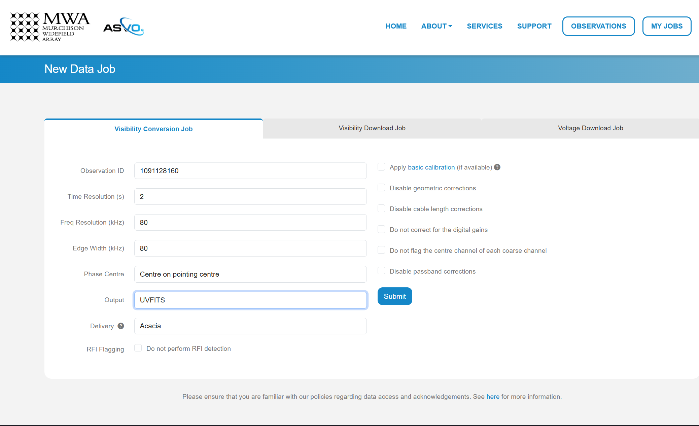

In this download we are using an observation with Observation ID (which is the GPS time) 1091128160. We set the Time Resolution(s) to ``2``, Frequency Resolution and Edge Width to ``80 kHz``, Phase Centre to ``Centre on pointing centre`` and swap the 'Output' format to ``UVFITS``. Click Submit to launch the job.

.. tip::

  If you change these values for time resolution, frequency resolution and/or edge width double check your skymodel is using the same parameters.

We also need a metafits tile, which we can access via the 'Visibility Download Job' tab. Input the Obs ID, and be sure to click the 'PPD, Metafits, and Flags' option like below (otherwise you download the raw data as well, which we don't need):

.. image:: meta_job_form.png
  :width: 800px

You can check the status of your download by clicking 'My Jobs' in the top left. Once they are ready to download, you'll see something like:

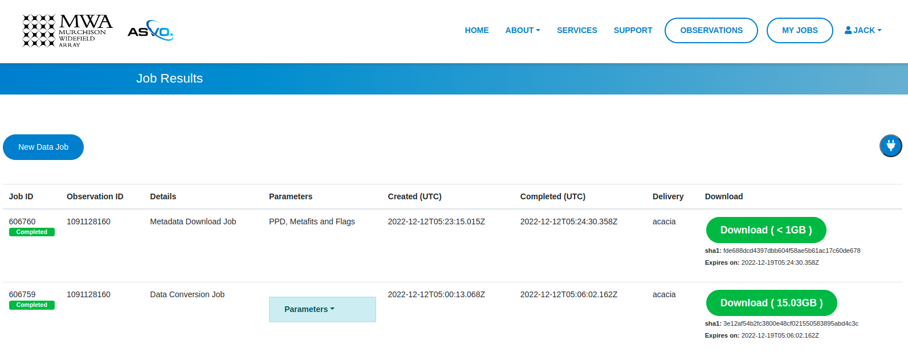

Getting the tutorial data
-------------------------

For the data we use for the full MWA observations you can download the required files from here:

`PyFHD Tutorial Data <https://tinyurl.com/pyfhd-tutorial-data>`_

Each directory is an observation, and inside each directory it will contain the following files:

- ``<obs_id>.uvfits`` - The UVFITS file for the observation
- ``<obs_id>.metafits`` - The MWA metafits file for the observation
- ``puma_LoBES_2s_80kHz_hbeam_<obs_id>.uvfits`` - The skymodel generated by `WODEN`_ for the observation

Separately, there will be a beam file ``decomp_beam_pointing0.h5`` which is the beam file for an observation at pointing 0
for MWA. The beam file is used for gridding, and isn't required for calibration.

Calibration
-----------

Calibration is fully available in ``PyFHD`` and can be enabled using the ``--calibrate-visibilities`` option being set to true. Most of the options for calibration are found under the 
`Calibration <../documentation/documentation.html#PyFHD.pyfhd_tools.pyfhd_setup-pyfhd_parser-calibration>`_ group in the argument parser. 
The first example we'll do is the a calibration of the sample data using only the command line interface to show the options that changed
in comparison to the template in the root of the repository (which will be used by default here).

Running calibration on the sample data
++++++++++++++++++++++++++++++++++++++

.. tip::

  This assumes you have retrieved the sample data and have it the directory ``input/1088285600_example/``. If you haven't retrieved the sample data, please refer to the section above on how to get the :ref:`sample-data`.
  

.. code-block:: bash

  pyfhd \
    --input-path "./input/1088285600_example/" \
    --beam-file-path "./input/1088285600_example/gauss_beam_pointing0_167635008Hz.h5" \
    --beam-offset-time 0 \
    --no-cable-bandpass-fit \
    --no-cal-reflection-hyperresolve \
    --cal-reflection-mode-theory 0 \
    --no-calibration-auto-initialize \
    --no-vis-baseline-hist \
    --no-digital-gain-jump-polyfit \
    --cal-stop \
    --no-flag-frequencies \
    --description "1088285600_example_cal_stop" \
    --model-file-type "uvfits" \
    --model-file-path "./input/1088285600_example/1088285600_model.uvfits" \
    --calibration-plots \
    --gridding-plots \
    --image-plots \
    1088285600

Here you some some solutions from the calibration of the sample data:

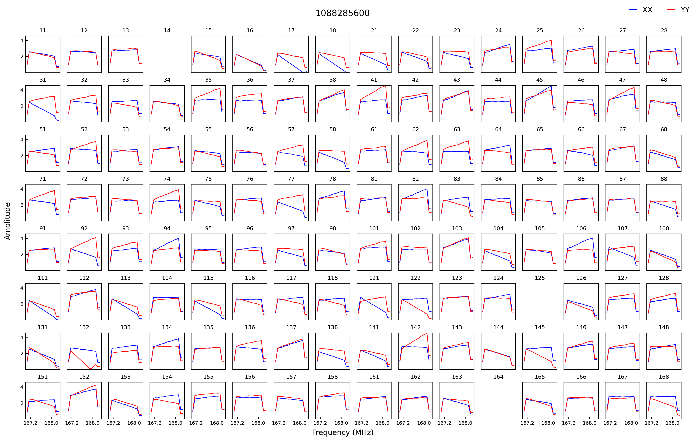

.. image:: 1088285600_cal_phase.png
  :width: 800px

Running calibration on a full MWA observation
+++++++++++++++++++++++++++++++++++++++++++++

For this observation I put everything inside the ``/place/for/input`` directory under ``uvfits``, ``models`` and ``beams`` sub-directories.
The input visibility data is inside the ``uvfits`` directory, the model generated by WODEN is inside the ``models`` directory and
the beam is inside the ``beams`` directory (not that we need it for this run, as we use ``--cal-stop`` to stop ``PyFHD`` after calibration).

.. code-block:: bash

    pyfhd \
        1091128160 \
        --input_path=/place/for/input/uvfits/1091128160 \
        --calibrate-visibilities \
        --cable-bandpass-fit \
        --calibration-polyfit \
        --cal-amp-degree-fit 2 \
        --cal-phase-degree-fit 1 \
        --cal-reflection-hyperresolve \
        --cal-reflection-mode-theory=150 \
        --no-cal-reflection-mode-delay \
        --no-cal-reflection-mode-file \
        --no-calibration-auto-fit \
        --no-calibration-auto-initialize \
        --no-cal-adaptive-calibration-gain \
        --vis-baseline-hist \
        --bandpass-calibrate \
        --auto-ratio-calibration \
        --no-cal-time-average \
        --no-digital-gain-jump-polyfit \
        --calibration-plots
        --cal-stop \
        --output_path "/path/to/outputs/" \
        --description 1091128160 \
        --model_file_type "uvfits" \
        --model_file_path "./path/to/model/1091128160/puma_LoBES_2s_80kHz_hbeam_1091128160.uvfits" 

.. tip::

  The full configuration file to set all the options in the above command can be seen below

  .. raw:: html

    

    
1091128160.yaml

    

  .. code-block:: yaml

    # Default Arguments for PyFHD
    # ~ returns None in Python (i.e. NULL)
    input-path : '/path/to/input/uvfits/1091128160'
    recalculate-all : false
    silent : false
    log-file : true
    conserve-memory : false
    instrument : 'mwa'
    memory-threshold : 100000000
    dimension : 2048
    elements : 2048
    kbinsize : 0.5
    FoV : ~
    min-baseline : 1.
    n-pol : 2
    deproject-w-term : ~

    # Checkpointing
    save-checkpoints: false
    obs-checkpoint: ~
    calibrate-checkpoint: ~
    gridding-checkpoint: ~

    # Instrument
    override-target-phasera: ~
    override-target-phasedec: ~

    # Beam Setup
    beam-file-path: ~
    lazy-load-beam: true
    recalculate-beam : true
    beam-clip-floor : true
    interpolate-kernel : true
    dipole-mutual-coupling-factor : true
    beam-nfreq-avg : 16
    psf-dim: 54
    psf-resolution : 100
    beam-mask-threshold: 100
    beam-model-version : 2
    beam-offset-time : 0
    beam-per-baseline: false

    # Calibration
    calibrate-visibilities : true
    cable-bandpass-fit : true # Depends on instrument cable length text file
    cal-bp-transfer : ~
    calibration-polyfit : true
    allow-sidelobe-cal-sources : true
    cal-amp-degree-fit : 2
    cal-phase-degree-fit : 1
    cal-reflection-hyperresolve : true
    cal-reflection-mode-theory : 150
    cal-reflection-mode-delay : false
    cal-reflection-mode-file : false
    calibration-auto-fit: false
    calibration-auto-initialize: false
    cal-gain-init: 1
    cal-convergence-threshold: 1e-7
    cal-adaptive-calibration-gain: false
    cal-base-gain: ~ # This is set to None by default to set the default based on cal-adaptive-calibration-gain as per FHD
    cal-phase-fit-iter: 4
    min-cal-baseline : 50.
    vis-baseline-hist : true
    bandpass-calibrate : true
    auto-ratio-calibration: true
    cal-time-average: false
    digital-gain-jump-polyfit: false
    return-cal-visibilities : true
    calibration-flag-iterate : 0
    diffuse-calibrate : ~
    calibration-catalog-file-path  :  ~ # 'GLEAM_v2_plus_rlb2019.sav' (FHD Default)
    transfer-calibration : ~
    cal-stop : true
    transfer-model-uv : ~
    max-cal-iter: 100

    # Flagging
    flag-basic: true
    flag-freq-start : ~
    flag-freq-end : ~
    flag-tiles: []
    flag-frequencies: false
    flag-model: true
    flag-calibration : true
    flag-calibration-frequencies: false
    flag-visibilities : false
    transfer-weights : ~
    time-cut: ~

    # Gridding
    recalculate-grid : true
    image-filter : 'filter_uv_uniform'
    mask-mirror-indices: false
    grid-spectral: false
    grid-weights: true
    grid-variance: true
    grid-uniform: false

    # Deconvolution
    # deconvolve : false
    # max-deconvolution-components : 20000
    # filter-background : true
    # smooth-width : 32
    dft-threshold : true
    # return-decon-visibilities : false
    # deconvolution-filter : 'filter_uv_uniform'

    # Export
    output-path : '/path/to/output'
    export-images : true
    save-obs: true
    save-params: true
    save-cal: true
    save-visibilities : false
    save-weights: false
    save-healpix-fits: false
    snapshot-healpix-export : false
    pad-uv-image : 1.
    ring-radius-multi : 10.
    description : 1091128160

    # Plotting
    calibration-plots: true
    gridding-plots: true
    image-plots: true

    # Model
    # Current choices of model-file-type are sav and uvfits
    model-file-type : 'uvfits'
    # If you set model-file-type to uvfits, set import-model-uvfits to the (ideally absolute) path of the fits file
    # If model-file-type is set to sav then it will look for the sav files as said in the function import_vis_model_from_sav
    model-file-path: '/path/to/models/1091128160/puma_LoBES_2s_80kHz_hbeam_1091128160.uvfits'
    diffuse-model : ~
    model-catalog-file-path  :  ~ # 'GLEAM_v2_plus_rlb2019.sav' (FHD Default)
    allow-sidelobe-model-sources : false

    # Simulation
    # run-simulation : false
    # in-situ-sim-input : ~
    # eor-vis-filepath : ~
    # enhance-eor : 1
    # sim-noise : ~
    # tile-flag-list : ~
    # remove-sim-flags : false

    # HEALPIX
    ps-kbinsize : 0.5
    ps-kspan : 200
    ps-beam-threshold: 0
    ps-fov: ~
    ps-dimension: ~
    ps-degpix: ~
    ps-nfreq-avg: ~
    ps-tile-flag-list: []
    n-avg : 2
    rephase-weights: True
    restrict-healpix-inds : true
    healpix-inds: ~
    split-ps-export : true

  .. raw:: html

    

    

.. note:: On a system with 20 cores (AMD Ryzen 5900X) this command took around 31 minutes to run.

If you look in the ``/path/to/output/pyfhd_1091128160/plots/calibration`` you will find plots including the calibration amplitude and phases:

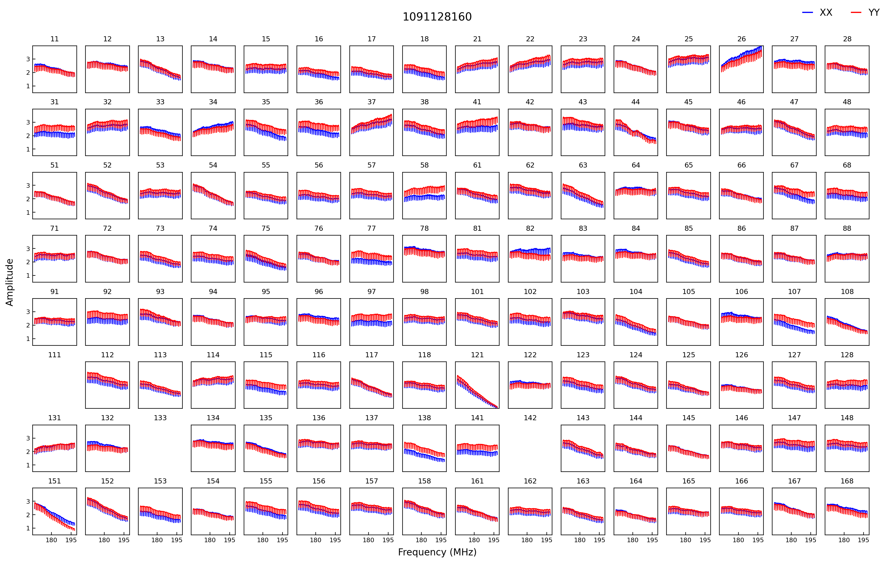

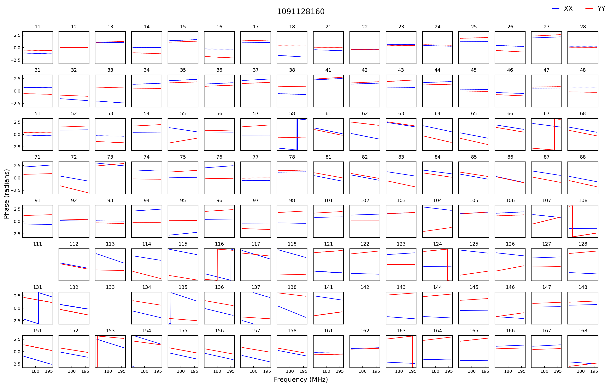

We have solutions!

.. Running advanced calibration
.. ++++++++++++++++++++++++++++
.. .. todo::
   
..    Check what this calibration is actually doing, and whether it is actually updating the solutions in the second part. The add motivation as to why we have to run in this manner

.. .. note:: This mode of running is intended for power users of ``FHD`` who already know what they want to run, but want to take advantage of ``PyFHD`` already.

.. Sometimes it makes sense to get an initial set of calibration solutions using one sky model, and then update them using a different sky model. First, run an initial calibration with default arguments:

.. .. code-block:: bash

..     pyfhd \
..         1088281328 \
..         --input_path=data \
..         --output_path=/place/for/outputs/ \
..         --description=cal_data \
..         --calibration_catalog_file_path=/path/to/sky_model/GLEAM_v2_plus_rlb2019.sav \
..         --conserve_memory --memory_threshold=1000000000 \
..         --IDL_calibrate

.. This results in calibration solutions that look somewhat ratty:

.. .. image:: 1088281328_cal_amp.png
..   :width: 600px

.. .. image:: 1088281328_cal_phase.png
..   :width: 600px

.. If you have a set of ``FHD`` ``IDL`` keywords to control calibration, you can simply add them into a text file (as they would appear in ``IDL``) and supply that text file as the argument to ``--IDL_keywords_file``. ``PyFHD`` will then copy these lines and add them into the ``.pro`` templates used to run ``FHD``. Here we'll update the calibration using a different sky model:

.. .. code-block:: bash

..   time pyfhd \
..     '1088281328' \
..     --input_path=/fred/oz048/MWA/data/2014/van_vleck_corrected/coarse_corr_no_ao/ \
..     --output_path=/fred/oz048/jline/ADACS/test_PyFHD/calibrate_real_data/ \
..     --description=cal_data_advanced \
..     --conserve_memory --memory_threshold=1000000000 \
..     --IDL_calibrate \
..     --IDL_variables_file fhd_variables.pro

.. where ``fhd_variables.pro`` looks like:

.. .. code-block:: idl

..     pointing='-2'
..     calibrate_visibilities=1
..     return_cal_visibilities=1
..     ;save_uvf=1
..     noao_coarse=1
..     model_visibilities=1
..     model_transfer='/fred/oz048/MWA/CODE/FHD/fhd_nb_data_gd_woden_calstop/woden_models/combined/'
..     conserve_memory=1e9
..     recalculate_all=1
..     mapfn_recalculate=0
..     beam_nfreq_avg=1
..     ps_kspan=200.
..     transfer_psf='/fred/oz048/MWA/CODE/FHD/fhd_nb_data_pointing_beam/beams/gauss_beam_pointing'+pointing+'.sav'
..     transfer_weights='/fred/oz048/MWA/CODE/FHD/fhd_nb_data_gd_woden_redo_redo/vis_data/'+obs_id+'_flags.sav'
..     export_images=1
..     force_data=1
..     grid_recalculate=0
..     transfer_calibration='/fred/oz048/MWA/CODE/FHD/fhd_nb_data_gd_woden_calstop/cal_transfer/'+obs_id+'_cal.sav'
..     restrict_hpx_inds='EoR0_high_healpix_inds_3x.idlsave'
..     interpolate_kernel=1
..     psf_dim=30
..     ;54 on 1e6 mask with -2, 62 on 1e7 with -2
..     beam_gaussian_decomp=1
..     psf_image_resolution=10.
..     psf_resolution=50.
..     ;54*250=13500 pixel side and 300sec fit, 54*50=2700 pixel side and 280sec fit
..     beam_mask_threshold=1e6
..     save_beam_metadata_only=1
..     beam_clip_floor=0

.. This advanced calibration is transferring an initial set of calibration solutions (using ``transfer_calibration``) and running calibration again using an existing sky model (using ``model_transfer``). Amongst other things, it's also using a different primary beam model via the keyword ``transfer_psf``, and a pervious set of flags via ``transfer_weights``. This calibration results in tighter amplitude and flatter phase solutions:

.. .. image:: 1088281328_cal_amp_advanced.png
..   :width: 600px

.. .. image:: 1088281328_cal_phase_advanced.png
..   :width: 600px

Gridding 
---------

.. note::
  
  Performing gridding in PyFHD, requires you to import a beam, the beams that are currently supported are those generated by ``FHD``, however, ``PyFHD`` has nothing currently to do the beam forming (although work has been done on this checkout `Beam Setup <Beam Setup_>`). Reading in a sav file is done using ``scipy.io.readsav`` and the beam is converted to a numpy complex array, however for large beams this can take a long time and can use a lot of memory,
  so it should only be done once. ``PyFHD`` will save convert any beam ``sav`` file into a ``HDF5`` file, in the same location as the ``sav`` file. 

Running the gridding step in ``PyFHD`` is relatively simple as its enabled by default, and the small number of options available to you are found in the `Gridding <../documentation/documentation.html#PyFHD.pyfhd_tools.pyfhd_setup-pyfhd_parser-gridding>`_ section of the argument parser.

Running Gridding with the sample data
+++++++++++++++++++++++++++++++++++++

We'll use the calibrate-checkpoint example earlier to run it

.. code-block:: bash

  pyfhd -c ./input/1088285600_example/1088285600_example.yaml --calibrate-checkpoint ./output/pyfhd_1088285600_example/checkpoints/1088285600_example_calibrate_checkpoint.h5 1088285600 

This would be the same as runnning the command below:

.. code-block:: bash

  pyfhd \
    --input-path "./input/1088285600_example/" \
    --description "1088285600_gridding_example" \
    --beam-file-path "./input/1088285600_example/gauss_beam_pointing0_167635008Hz.h5" \
    --calibrate-checkpoint "./output/pyfhd_1088285600_example/checkpoints/1088285600_example_calibrate_checkpoint.h5" \
    --recalculate-grid \
    --image-filter 'filter_uv_uniform' \
    --no-mask-mirror-indices \
    --no-grid-spectral \
    --grid-weights \
    --grid-variance \
    --no-grid-uniform \
    --gridding-plots \
    --no-snapshot-healpix-export \
    1088285600

Below we have the example plots of the gridded continuum data for the two polarizations, XX and YY, for the sample data.

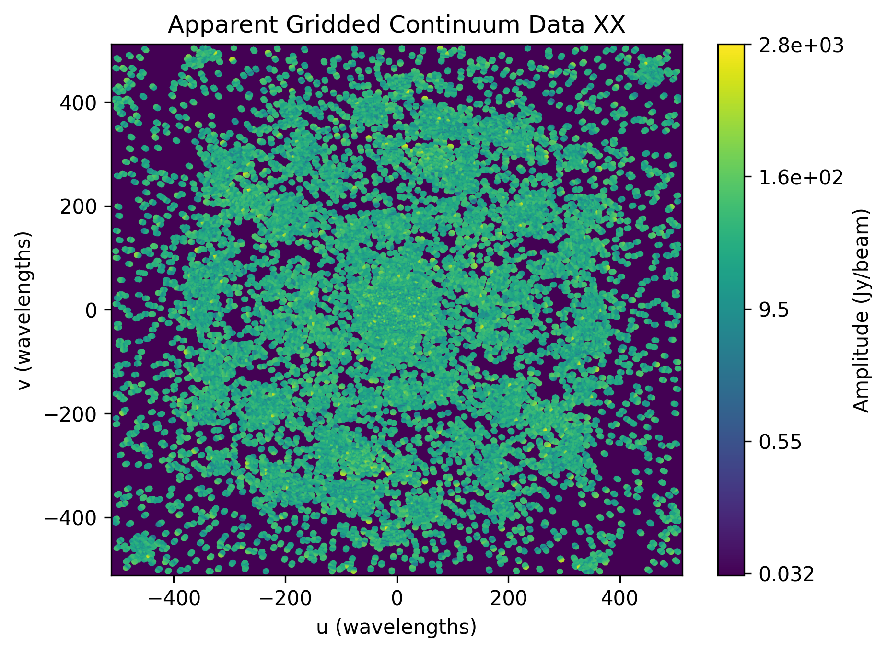

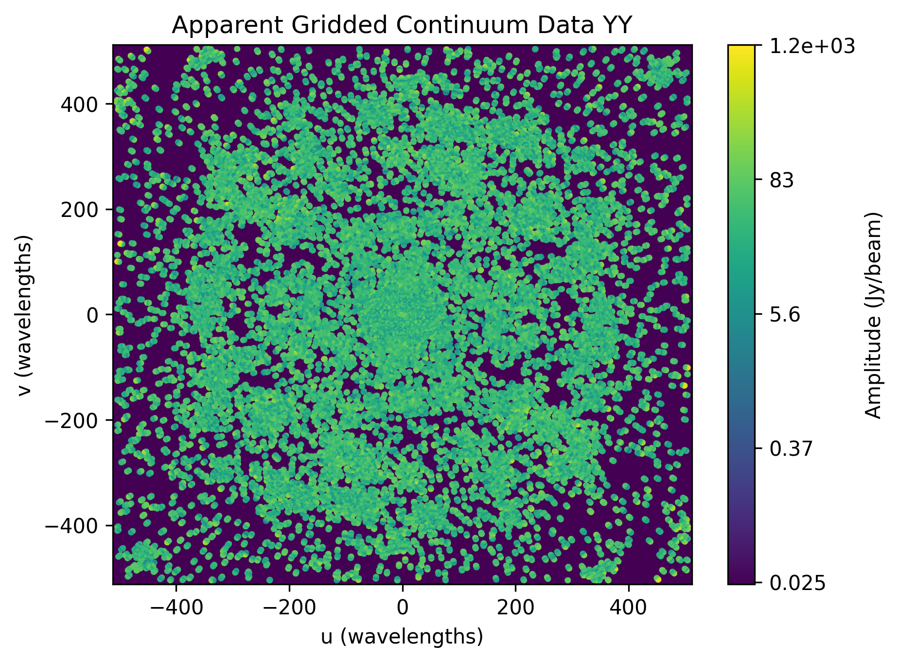

Running Gridding with a full MWA observation
++++++++++++++++++++++++++++++++++++++++++++

In this observation we will run calibration and then use the results for gridding, you'll notice some more advanced options
being used here. Such options like ``--digital-gain-jump-polyfit`` should only be used if you know that it's needed (although
``PyFHD`` will warn you if you try to use it in the wrong conditions). Also take notice that the beam is being loaded here, through
the use of the ``--beam-file-path`` option, this is required for gridding to work. If you wish to learn more about the ``--lazy-load-beam``
option refer to :ref:`lazy-loading` section below.

.. code-block:: bash

   pyfhd \
      1088281328 \
      --input-path "/path/to/input/uvfits/1088281328" \
      --output-path "/path/to/output/" \
      --description 1088281328 \
      --beam-file-path "path/to/beams/decomp_beam_pointing0.h5" \
      --lazy-load-beam: true \
      --model-file-type "uvfits" \
      --model-file-path "./path/to/models/1088281328/puma_LoBES_2s_80kHz_hbeam_1088281328.uvfits" \
      --recalculate-grid \
      --image-filter "filter_uv_uniform" \
      --grid-weights \
      --grid-variance \
      --calibrate-visibilities \
      --cable-bandpass-fit \
      --calibration-polyfit \
      --cal-amp-degree-fit 2 \
      --cal-phase-degree-fit 1 \
      --cal-reflection-hyperresolve \
      --cal-reflection-mode-theory 150 \
      --no-cal-reflection-mode-delay \
      --no-cal-reflection-mode-file \
      --no-calibration-auto-fit \
      --no-calibration-auto-initialize \
      --no-cal-adaptive-calibration-gain \
      --vis-baseline-hist \
      --bandpass-calibrate \
      --auto-ratio-calibration \
      --no-cal-time-average \
      --digital-gain-jump-polyfit \
      --calibration-plots \
      --gridding-plots
      

Below we have the example plots of the gridded continuum data for the two polarizations, XX and YY, for the full MWA data.

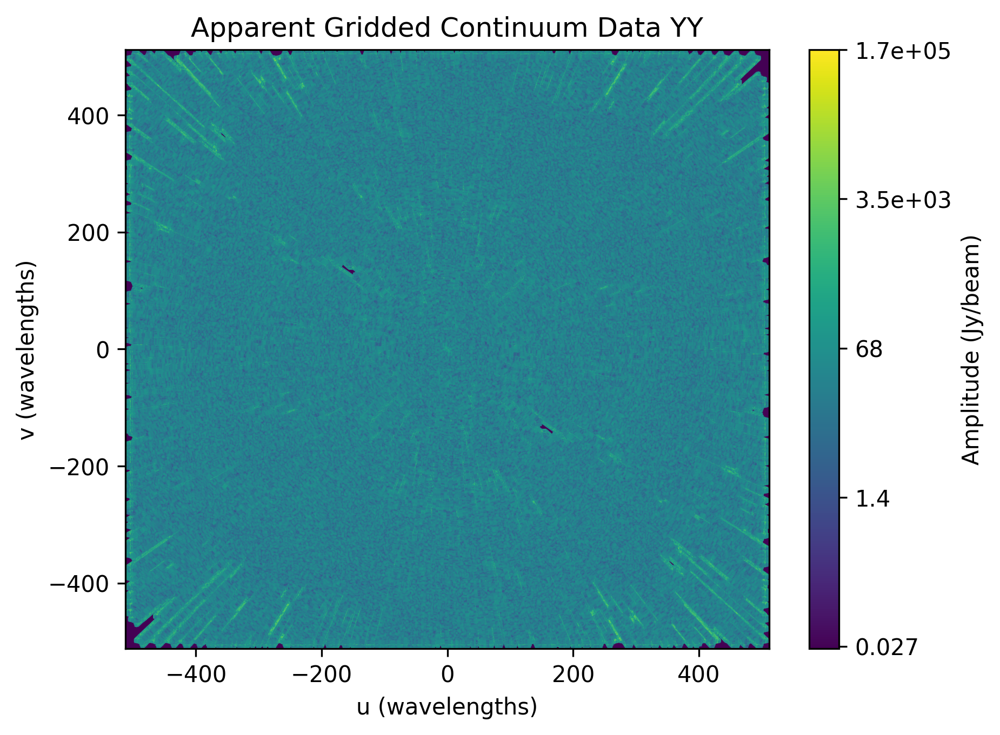

We can also see the continuum gridded model visibilities.

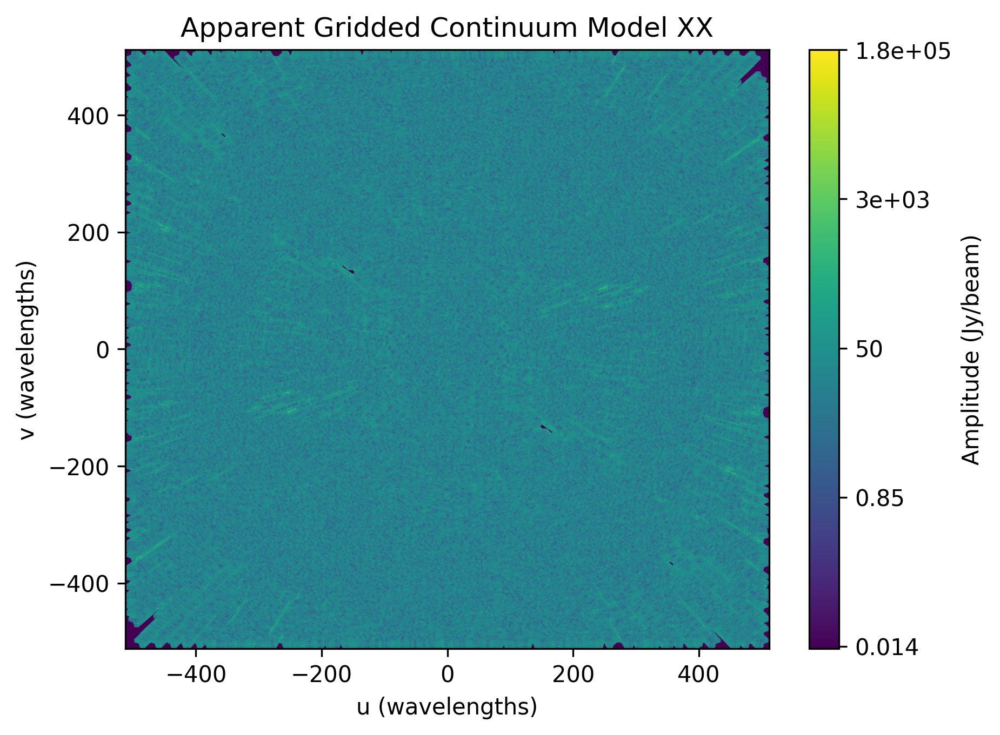

We can also plot the variance of the gridded visibilities.

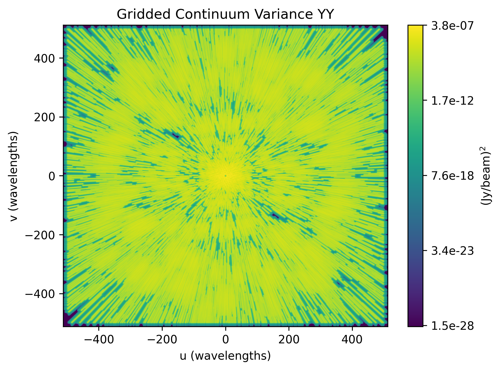

Other Telescopes
----------------
``PyFHD`` was translated and tested with MWA data, but in theory should need minor adjusting to support additional telescopes. 

.. important::

  Getting data for testing additional telescopes is under way, if you wish for PyFHD to support a new telescope we need the following for testing:

  - UVFITS file
  - Any associated metadata files you use - MWA uses metafits, but other telescopes may use different formats if any at all
  - A beam file - IDL SAVE (sav) files, HDF5 (h5) files, if the beam can be done with `pyuvdata`_, please give an example of how to create the beam response
  - A skymodel file - ideally UVFITS, but we can potentially support other file types as well depending on the complexity

Saving and Loading files
------------------------------------------------
``PyFHD`` uses ``HDF5`` files to store data in general.
``PyFHD`` uses ``h5py`` to read and write the files, the main functions that you can see how ``PyFHD``
saves and loads HDF5 files are in the ``pyfhd_io`` module, found here: `pyfhd_io <../_modules/PyFHD/io/pyfhd_io.html>`_. 
More specifically look for the ``save`` and ``load`` functions.

Examples of both can be seen below:

.. code-block:: python

  # Saving
  from PyFHD.io.pyfhd_io import save
  import numpy as np

  example_dict = {
    "example": np.arange(10),
    "example_group": {
      "example_in_group": np.arange(10),
    }
  }
  
  save("example.h5", example_dict, "example")

  # Loading

  from PyFHD.io.pyfhd_io import load
  
  loaded_example = load("example.h5")

  print(loaded_example["example"]) # [0, 1, 2, 3, 4, 5, 6, 7, 8, 9]
  print(loaded_example["example_group"]["example_in_group"]) # [0, 1, 2, 3, 4, 5, 6, 7, 8, 9]

If you wish to see the contents of the HDF5 file, there are ways outside of PyFHD to do this, you could use extensions for your IDE like 
`H5 Web <https://marketplace.visualstudio.com/items?itemName=h5web.vscode-h5web>`_ or you can use CLI tools like `h5dump <https://support.hdfgroup.org/documentation/hdf5/latest/_h5_t_o_o_l__d_p__u_g.html#sec_cltools_h5dump>`_.

An example of the beam HDF5 file for the sample data seen inside VSCode using H5 Web is shown below:

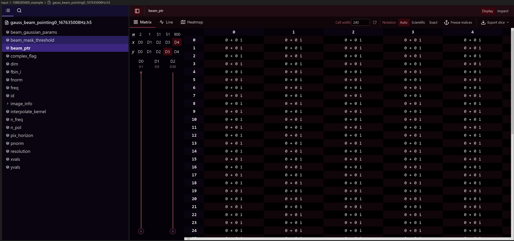

.. _lazy-loading:

Lazy Loading
+++++++++++++
The load function inside of ``PyFHD`` also has the capability to lazy load the data, which means that the data is not loaded into memory until you access it. 
This is done by setting the ``lazy_load`` argument to ``True`` when calling the load function. It's important to note that when a HDF5 file is lazy loaded, then the
loaded data is stored inside a ``HDF5 File`` object rather than a Python dictionary.

.. code-block:: python

  from PyFHD.io.pyfhd_io import load
  
  loaded_example = load("example.h5", lazy_load=True)

  print(type(loaded_example)) # <class 'h5py._hl.files.File'>
  print(loaded_example["example"]) # <HDF5 dataset "example": shape (10,), type "<i8">
  print(loaded_example["example_group"]["example_in_group"]) # <HDF5 dataset "example_in_group": shape (10,), type "<i8">

  # To access the data, you need to use the `[:]` operator which tells the H5File object to load the data into memory
  # and return it as a numpy array
  print(loaded_example["example"][:]) # [0, 1, 2, 3, 4, 5, 6, 7, 8, 9]
  print(loaded_example["example_group"]["example_in_group"][:]) # [0, 1, 2, 3, 4, 5, 6, 7, 8, 9]

This is useful primarily for any beam files that are large, as they can take a long time to load into memory and can use a lot of memory.

.. tip::
  
  If you are using lazy loading, then you need to be careful when using the data, as it is not loaded into memory until you access it. 
  This means that if you try to use the data in a way that requires it to be loaded into memory, you will need to wait for data to transfer
  from disk to memory, this can cause parts of the pipeline to be slow. Optimizations need to be done to better deal with the transfer of disk to memeory, 
  to better chunk the data into memory for processing. If you're happy to take that task on yourself, do a Pull Request!

Loading PyFHD Outputs into FHD
++++++++++++++++++++++++++++++
``PyFHD`` outputs can be loaded into ``FHD`` if you need it, PyFHD outputs are typically ``HDF5`` files, IDL is capable of reading in HDF5 files using functions like
`H5F_OPEN <https://www.nv5geospatialsoftware.com/docs/H5F_OPEN.html>`_, `H5D_OPEN <https://www.nv5geospatialsoftware.com/docs/H5D_OPEN.html>`_ and `H5D_READ <https://www.nv5geospatialsoftware.com/docs/H5D_READ.html>`_ 
(There are also the same functions for groups, replace ``F`` or ``D`` with ``G``). Loading the ``PyFHD`` into `FHD`_ does require some data manipulation to get it in the same format that `FHD`_ expects, for example,
the beam array is stored as pointer arrays in `FHD`_ on a per baseline basis, where the every baseline points to the to the first baseline. These sort of pointer array structures are used in many places across `FHD`_,
so to help you in the future, I'll supply two examples of how to load the sample data beam and models into IDL and convert them to the sav files which have the arrays in the format that `FHD`_ expects. These examples
are not complete (for example the model doesn't also create the params file), but they should give you a good idea of how to load the data into IDL and convert it to the format that `FHD`_ expects.

.. raw:: html

  

  
convert_model_arr_to_sav.pro

  

.. code-block:: idl

  PRO convert_model_arr_to_sav,save_dir, obs_id, n_pol

    ;this is the model visibilities as written out by PyFHD
    hdf5_filepath = save_dir + "/" + obs_id + "_vis_model.h5"

    ;load in the hdf5 file
    print, "Now loading model data from ", hdf5_filepath
    file_id = H5F_OPEN(hdf5_filepath)
    
    ;for as many polarisations as specified by n_pol, write out FHD style .sav
    ;files
    pol_names = ['XX', 'YY', 'XY', 'YX']

    model_dataset_id = H5D_OPEN(file_id, "vis_model_arr")
    ;this reads into a struct containing real and imaginary as separate values
    model_data = H5D_READ(model_dataset_id)

    ; for pol = 0, 0 do begin
    for pol = 0, n_pol-1 do begin

        ;read in this polarisation from the hdf5 file
        ;things have to be saved inside a pointer array for FHD to load it back
        ;in correctly
        vis_model_ptr=PTRARR(1, /allocate)
        *vis_model_ptr[0] = COMPLEX(model_data.r, model_data.i)

        print, "Writing model uvfits to .sav file: " + obs_id + "_vis_model_" + pol_names[pol] + ".sav"

        ;save into the FHD vis_model format and naming convention
        idl_save = save_dir + "/" + obs_id + "_vis_model_" + pol_names[pol] + ".sav"
        save, vis_model_ptr, filename = idl_save

    endfor
    ;close the hdf5 data struct, done with it now
    H5D_CLOSE, model_dataset_id
    ;close file, let's be tidy
    H5F_CLOSE, file_id
  END

.. raw:: html

  

  

.. raw:: html

  

  
convert_beam_to_sav.pro

  

.. code-block:: idl

  PRO convert_beam_to_sav, save_dir, beam_file, obs_file

    ;this is the model visibilities as written out by PyFHD run
    beam_filepath = save_dir + "/" + beam_file
    obs_filepath = save_dir + "/" + obs_file

    ;load in the hdf5 file
    print, "Now loading model data from ", beam_filepath
    file_id = H5F_OPEN(beam_filepath)
    
    ;Get all the ints and floats from the hdf5 file
    beam_mask_threshold = H5D_OPEN(file_id, "beam_mask_threshold")
    beam_mask_threshold = H5D_READ(beam_mask_threshold)
    complex_flag = H5D_OPEN(file_id, "complex_flag")
    complex_flag = (H5D_READ(complex_flag))[0]
    dim = H5D_OPEN(file_id, "dim")
    dim = H5D_READ(dim)
    fbin_i = H5D_OPEN(file_id, "fbin_i")
    fbin_i = H5D_READ(fbin_i)
    fnorm = H5D_OPEN(file_id, "fnorm")
    fnorm = H5D_READ(fnorm)
    freq = H5D_OPEN(file_id, "freq")
    freq = H5D_READ(freq)
    id = H5D_OPEN(file_id, "id")
    id = transpose(H5D_READ(id))
    interpolate_kernel = H5D_OPEN(file_id, "interpolate_kernel")
    interpolate_kernel = (H5D_READ(interpolate_kernel))[0]
    n_freq = H5D_OPEN(file_id, "n_freq")
    n_freq = (H5D_READ(n_freq))[0]
    n_pol = H5D_OPEN(file_id, "n_pol")
    n_pol = (H5D_READ(n_pol))[0]
    pix_horizon = H5D_OPEN(file_id, "pix_horizon")
    pix_horizon = H5D_READ(pix_horizon)
    pnorm = H5D_OPEN(file_id, "pnorm")
    pnorm = H5D_READ(pnorm)
    resolution = H5D_OPEN(file_id, "resolution")
    resolution = H5D_READ(resolution)
    xvals = H5D_OPEN(file_id, "xvals")
    xvals = transpose(H5D_READ(xvals))
    yvals = H5D_OPEN(file_id, "yvals")
    yvals = transpose(H5D_READ(yvals))

    ; image_info
    image_info = H5G_OPEN(file_id, "image_info")
    dec_arr = H5D_OPEN(image_info, "dec_arr")
    dec_arr = transpose(H5D_READ(dec_arr))
    ra_arr = H5D_OPEN(image_info, "ra_arr")
    ra_arr = transpose(H5D_READ(ra_arr))
    psf_image_dim = H5D_OPEN(image_info, "psf_image_dim")
    psf_image_dim = (H5D_READ(psf_image_dim))[0]
    psf_image_resolution = H5D_OPEN(image_info, "psf_image_resolution")
    psf_image_resolution = (H5D_READ(psf_image_resolution))[0]
    h5g_close, image_info
    image_info = ptr_new( $
        create_struct( $
            'dec_arr', dec_arr,$
            'ra_arr', ra_arr, $
            'psf_image_dim', psf_image_dim, $
            'psf_image_resolution', psf_image_resolution $
        ) $
    ) 
    

    beam_gaussian_params_h5 = H5D_OPEN(file_id, "beam_gaussian_params")
    beam_gaussian_params_h5 = H5D_READ(beam_gaussian_params_h5)
    beam_gaussian_params_h5 = transpose(beam_gaussian_params_h5)
    beam_gaussian_params_dims = reverse(size(beam_gaussian_params_h5, /dim))
    beam_gaussian_params = PTRARR(beam_gaussian_params_dims[0])
    for pol_i = 0, n_pol - 1 do begin
        beam_gaussian_params[pol_i] = PTR_NEW(beam_gaussian_params_h5[pol_i, *, *])
    endfor

    beam_ptr_h5 = H5D_OPEN(file_id, "beam_ptr")
    beam_ptr_h5 = H5D_READ(beam_ptr_h5)
    dims = size(beam_ptr_h5, /dim)
    beam_ptr = PTR_NEW(PTRARR(n_pol, n_freq, (size(id, /dim))[-1]))
    for pol_i = 0, n_pol-1 do begin
        for freq_i = 0, n_freq-1 do begin
            box_matrix = ptrarr(dims[2], dims[1])
            for box_x = 0, dims[1] - 1 do begin
                for box_y = 0, dims[2] - 1 do begin                    
                    box_matrix[box_x, box_y] = ptr_new(COMPLEX(beam_ptr_h5[*, box_y, box_x, freq_i, pol_i].r, beam_ptr_h5[*, box_y, box_x, freq_i, pol_i].i))
                endfor
            endfor
            (*beam_ptr)[pol_i, freq_i, *] = PTR_NEW(box_matrix)
        endfor
    endfor

    psf = create_struct( $
        'beam_mask_threshold', beam_mask_threshold, $
        'beam_ptr', beam_ptr, $
        'beam_gaussian_params', beam_gaussian_params, $
        'complex_flag', complex_flag, $
        'dim', dim, $
        'fbin_i', fbin_i, $
        'fnorm', fnorm, $
        'freq', freq, $
        'id', id, $
        'interpolate_kernel', interpolate_kernel, $
        'n_freq', n_freq, $
        'n_pol', n_pol, $
        'pix_horizon', pix_horizon, $
        'pnorm', pnorm, $
        'resolution', resolution, $
        'xvals', xvals, $
        'yvals', yvals, $
        'image_info', image_info $
    )

    obs_file_id = H5F_OPEN(obs_filepath)
    baseline_info_id = H5G_OPEN(obs_file_id, "baseline_info")
    ; dataset     /baseline_info/bin_offset      H5T_INTEGER [2]
    bin_offset = H5D_OPEN(baseline_info_id, "bin_offset")
    bin_offset = H5D_READ(bin_offset)
    ; dataset     /baseline_info/fbin_i          H5T_INTEGER [16]
    fbin_i = H5D_OPEN(baseline_info_id, "fbin_i")
    fbin_i = H5D_READ(fbin_i)
    ; dataset     /baseline_info/freq            H5T_FLOAT [16]
    freq = H5D_OPEN(baseline_info_id, "freq")
    freq = H5D_READ(freq)
    ; dataset     /baseline_info/freq_use        H5T_INTEGER [16]
    freq_use = H5D_OPEN(baseline_info_id, "freq_use")
    freq_use = H5D_READ(freq_use)
    ; dataset     /baseline_info/jdate           H5T_FLOAT [2]
    jdate = H5D_OPEN(baseline_info_id, "jdate")
    jdate = H5D_READ(jdate)
    ; dataset     /baseline_info/tile_a          H5T_INTEGER [16002]
    tile_a = H5D_OPEN(baseline_info_id, "tile_a")
    tile_a = H5D_READ(tile_a)
    ; dataset     /baseline_info/tile_b          H5T_INTEGER [16002]
    tile_b = H5D_OPEN(baseline_info_id, "tile_b")
    tile_b = H5D_READ(tile_b)
    ; dataset     /baseline_info/tile_flag       H5T_INTEGER [128]
    tile_flag = H5D_OPEN(baseline_info_id, "tile_flag")
    tile_flag = H5D_READ(tile_flag)
    ; dataset     /baseline_info/tile_height     H5T_FLOAT [128]
    tile_height = H5D_OPEN(baseline_info_id, "tile_height")
    tile_height = H5D_READ(tile_height)
    ; dataset     /baseline_info/tile_names      H5T_INTEGER [128]
    tile_names = H5D_OPEN(baseline_info_id, "tile_names")
    tile_names = H5D_READ(tile_names)
    ; dataset     /baseline_info/tile_use        H5T_INTEGER [128]
    tile_use = H5D_OPEN(baseline_info_id, "tile_use")
    tile_use = H5D_READ(tile_use)
    ; dataset     /baseline_info/time_use        H5T_INTEGER [2]
    time_use = H5D_OPEN(baseline_info_id, "time_use")
    time_use = H5D_READ(time_use)

    baseline_info = create_struct( $
        'bin_offset', bin_offset, $
        'fbin_i', fbin_i, $
        'freq', freq, $
        'freq_use', freq_use, $
        'jdate', jdate, $
        'tile_a', tile_a, $
        'tile_b', tile_b, $
        'tile_flag', tile_flag, $
        'tile_height', tile_height, $
        'tile_names', tile_names, $
        'tile_use', tile_use, $
        'time_use', time_use $
    )

    H5G_CLOSE, baseline_info_id

    n_baselines = H5D_OPEN(obs_file_id, "n_baselines")
    n_baselines = (H5D_READ(n_baselines))[0]
    n_pol = H5D_OPEN(obs_file_id, "n_pol")
    n_pol = (H5D_READ(n_pol))[0]

    baseline_info = ptr_new(baseline_info)
    obs = create_struct( $
        'baseline_info', baseline_info, $
        'nbaselines', n_baselines, $
        'n_pol', n_pol, $
        'primary_beam_area', ptrarr(4),$
        'primary_beam_sq_area', ptrarr(4) $
    )

    save, psf, obs, filename = save_dir + "/gauss_beam_pointing0_167635008Hz.sav"
    ;close the hdf5 file
    H5F_CLOSE, file_id
    H5F_CLOSE, obs_file_id

  END

.. raw:: html

  

  

Docker
------
``PyFHD`` has a docker image available to use available on `Docker Hub <https://hub.docker.com/r/skywa7ch3r/pyfhd>`_.
There will be multiple images available, there will be an image for each version that should get pushed on every release of ``PyFHD``,
there will also be a ``latest`` tag that will be the latest version of ``PyFHD`` based on commits from the main branch (though this may not be stable and subject to change).

To run the docker image of PyFHD, you can use the following commands:

.. code-block:: bash

  # To see the PyFHD version of latest
  docker run -it skywa7ch3r/pyfhd:latest pyfhd -v

.. code-block:: bash
  
  # To run PyFHD with the sample data (with the output going to the current directory)
  docker run -it --volume /path/to/output:/pyfhd/output --user $(id -u):$(id -g) skywa7ch3r/pyfhd:latest  \
    pyfhd -c ./input/1088285600_example/1088285600_example.yaml \
    --description 108825600_docker_example \
    1088285600

The folllwing example will run with the full MWA observation, you will need to make sure the yaml configuration file points to directories that are mounted to the docker container.
The YAML configuration also should point to directories inside the container as well, by default ``PyFHD`` is configured to look for things inside the ``input`` and ``output`` directories inside the container.

.. code-block:: bash

  # To run PyFHD with full MWA observation
  docker run -it \
    --volume /absolute/path/to/config/1091128160.yaml:/pyfhd/input/1091128160.yaml \
    --volume /absolute/path/to/data/1091128160/:/pyfhd/input/1091128160 \
    --volume /absolute/path/to/beams/:/pyfhd/input/beams \
    --volume /absolute/path/to/output/:/pyfhd \
    --user $(id -u):$(id -g) 
    skywa7ch3r/pyfhd:latest \
    pyfhd -c ./input/1091128160.yaml \
    --description 1091128160_docker_example \
    1091128160

Apptainer (formerly Singularity)
--------------------------------

Creating an Apptainer image for using ``PyFHD`` where using docker isn't possible (such as on HPCs) can be done like so:

.. code-block:: bash

  apptainer build pyfhd.sif docker://skywa7ch3r/pyfhd:latest

.. code-block:: bash

  # To see the PyFHD version of latest
  apptainer run --pwd /pyfhd pyfhd.sif pyfhd -v

.. code-block:: bash
  
  # To run PyFHD with the sample data (with the output going to the current directory)
  apptainer run --pwd /pyfhd -B /path/to/output:/pyfhd/output pyfhd.sif \
    pyfhd -c ./input/1088285600_example/1088285600_example.yaml \
    --description 108825600_docker_example \
    1088285600

The following example will run with the full MWA observation, you will need to make sure the yaml configuration file points to directories that are mounted to the docker container.
The YAML configuration also should point to directories inside the container as well, by default ``PyFHD`` is configured to look for things inside the ``input`` and ``output`` directories inside the container.

.. code-block:: bash

  # To run PyFHD with full MWA observation
  apptainer run --pwd /pyfhd \
    -B /absolute/path/to/config/1091128160.yaml:/pyfhd/input/1091128160.yaml \
    -B /absolute/path/to/data/1091128160/:/pyfhd/input/1091128160 \
    -B /absolute/path/to/beams/:/pyfhd/input/beams \
    -B /absolute/path/to/output/:/pyfhd \
    pyfhd.sif \
    pyfhd -c ./input/1091128160.yaml \
    --description 1091128160_docker_example \
    1091128160

Problems that need to be solved
-------------------------------

.. attention:: 
  
  This entire section is a call to action!

  If you believe you can address these problems, and or do the features, then give it a go, please read the :doc:`Contribution Guide <../develop/contribution_guide>` and do a pull request!

  We await your contributions!

HEALPIX
+++++++
The HEALPIX outputs from ``PyFHD`` are stored in the ``healpix`` directory. The translated parts of ``healpix_snapshot_cube_generate.pro`` from ``FHD`` have precision errors and potential bugs and they have caused differences
in the resulting ``obs_id_hpx_even/odd_XX/YY.h5`` files the translation that exist in ``FHD``. So the ``obs_id_hpx_even/odd_XX/YY.h5`` files generated from ``PyFHD`` as the ``obs_id_even/odd_cubeXX/YY.sav`` files that exist in ``FHD``.
However I'm not sure if they should be given that the differentces could just precision in which case there might be a problem at all. Furthermore the size of the files that get generated and the format, is not easy to create in 
Python and takes a long time to create with regards to the rest of the ``PyFHD`` pipeline (and the resulting files are also large in when compared to other outputs). 
With that said, by default healpix files are generated, the entirety of ``PyFHD`` runs in full. If you want to ensure that HEALPIX files are generated then adjust a config of your choice with the followng options:

.. code-block:: yaml

  # Export
  output-path : './output'
  save-healpix-fits: true # IMPORTANT
  snapshot-healpix-export : true # IMPORTANT

  # HEALPIX (These are the defaults)
  ps-kbinsize : 0.5
  ps-kspan : 600
  ps-beam-threshold: 0
  ps-fov: ~
  ps-dimension: ~
  ps-degpix: ~
  ps-nfreq-avg: ~
  ps-tile-flag-list: []
  n-avg : 2
  rephase-weights: True
  restrict-healpix-inds : true
  healpix-inds: ~
  split-ps-export : true
  
The most important options are the ``save-healpix-fits`` and the ``snapshot-healpix-export`` options, which are set to ``true`` by default and are the toggles which allow the HEALPIX functions to be called. 

Beam Setup
++++++++++
The beam setup in ``PyFHD`` has been translated from `FHD`_ and is a combination of using `pyuvdata`_ and translation from `FHD`_, it is by no means tested and is definitely a work in progress.
More specifically, the ``beam_setup`` uses `pyuvdata`_ to create the ``Jones`` matrix for the beam, and then ``FHD`` translation is used to create the main response and the representation of the beam
in UV space. For the moment, PyFHD only supports using one beam per observation and does not currently support different beams for different antennas. Furthermore, mode advanced features like gaussian decomp and
many of the debugging options are not implemented, as such there are plenty of opportunities to add to the ``beam_setup``, both in small and large pieces of code.

You can see test out the beam_setup by setting the ``beam-file-path`` to ``None`` (~ in the yaml configuration file) and setting the ``recalculate-beam`` option to ``True``. You'll likely run into
memory limitations with your machine during testing. The ``beam_setup`` branch has been purposely left there ready for you to directly contribute code to it.

Deconvolution
++++++++++++++
Deconvolution is not currently implemented in ``PyFHD``, with that said, inside the gridding directory is ``visibility_degrid.py``, which has been translated from `FHD`_ and has not been tested at all.
That should give you a good start if you wish to implement deconvolution in ``PyFHD``. As a bonus, the deconvolution code in `FHD`_ has many dependencies that are used in the model generation, so if for whatever
reason you want the skymodel generation from `FHD`_ you might get most of that model generation code for free, if someone also does deconvolution in ``PyFHD``, you'll likely be only a week or two away from having model generation also.
Although, there's a good chance tools like `WODEN`_ will likely be faster and better at producing skymodels, so use those first before you try to implement model generation in ``PyFHD``.

4 Polarizations
+++++++++++++++
The ability for PyFHD to handle 4 polarizations is not well tested, and may not be fully implemented in places, another great opportunity to contribute.

Simulation
++++++++++
`FHD`_ has ability to do simulations, many of these simulation features haven't been translated to ``PyFHD``, this would be a large piece of work.